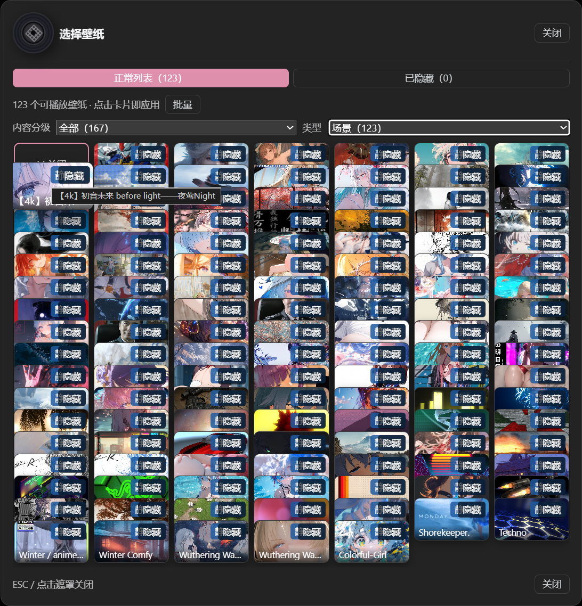
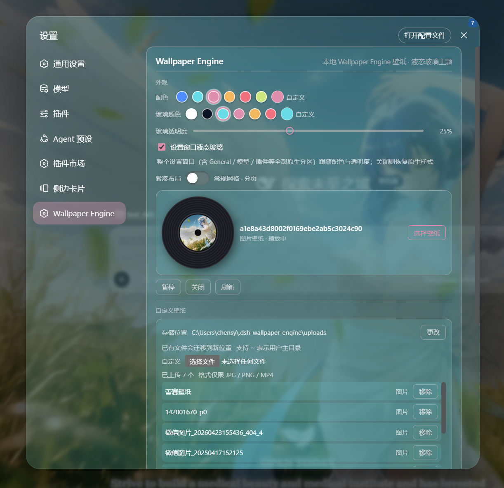

# dsh-plugin-wallpaper-engine

[English](README.md) | [中文](README.zh.md)

A DSH bundle that turns your **Wallpaper Engine** wallpapers into the **background of the DSH web GUI** (`dsh web`).

It discovers the wallpapers on your machine (WaifuX on macOS, Wallpaper Engine on Windows), lists them, and renders video/still wallpapers behind the DSH chat interface with an iOS-style **liquid glass** effect. You pick the wallpaper from a settings row, fine-tune it with four sliders, and pause/clear it anytime.

## Quick start (no command line needed)

**macOS (WaifuX wallpapers)**

1. Install **WaifuX**, log in (Steam account), download wallpapers you like — videos and stills both work
2. In DSH, open **Plugin Market**, search `wallpaper`, install this plugin (the mac build includes WaifuX support)
3. Open **Settings → General → Wallpaper Engine**, pick a wallpaper — the chat background updates immediately

No configuration needed: the plugin reads WaifuX's download folder automatically, and wallpapers you download later appear on their own. If text is hard to read, raise the **Dim** and **Border** sliders (instant effect). Wallpaper not showing? Restart DSH once after downloading, and make sure WaifuX uses its default download location.

**Windows (Wallpaper Engine wallpapers)**

1. Install **Wallpaper Engine** in Steam and subscribe to wallpapers (video / web)
2. Install this plugin from the DSH plugin market, then Settings → General → Wallpaper Engine → pick one

The plugin finds the Steam library automatically, on any drive.

## Why only Video and Web wallpapers?

Wallpaper Engine wallpapers come in four types:

| Type | Rendered by | Portable to DSH? |
|---|---|---|
| **Scene** | Wallpaper Engine's own 3D engine | ❌ No — native 3D (`.obj`/shaders), only WE can render it |
| **Video** | a plain `.mp4` file | ✅ Yes — plays in a `<video>` tag |
| **Web** | a Chromium (`webwallpaper64.exe`) host for HTML | ✅ Yes — loads in an `<iframe>` |
| **Application** | an injected external window | ❌ No |

This is the same fundamental limit that applies to **mineradio** and every other
third-party Wallpaper Engine integration: only *Video* and *Web* wallpapers are
portable. Scene wallpapers are therefore hidden from the thumbnail picker and
rotation candidates — they cannot be used as a live background here.

## How it works

- **Host half** (`lib/index.js`): a Cordis plugin that
  1. locates the Wallpaper Engine install by reading Steam's `libraryfolders.vdf`
     (so it works even when Steam is on a non-default drive),
  2. enumerates wallpapers from `projects/defaultprojects`, `projects/myprojects`,
     and `steamapps/workshop/content/431960/*`,
  3. registers same-origin HTTP routes on the DSH webserver so the browser half
     can fetch data and stream media directly:
     - `GET /wallpaper-engine/inventory` → JSON list of wallpapers
     - `GET /wallpaper-engine/media/<token>` → video / HTML (Range supported)
     - `GET /wallpaper-engine/preview/<token>` → preview image
- **Client half** (`lib/client.js`): a browser module that fetches the inventory
  and renders the selected wallpaper into a fixed layer *behind* the app columns,
  plus a "Wallpaper Engine" row in General settings with a picker.

## Install

### For users (published version, recommended)

- **Host 端**（`lib/index.js`）：一个 Cordis 插件，负责
  1. 通过读取 Steam 的 `libraryfolders.vdf` 定位 Wallpaper Engine 安装位置（所以 Steam 装在非默认盘也能用）；
  2. 从 `projects/defaultprojects`、`projects/myprojects` 以及 `steamapps/workshop/content/431960/*` 枚举壁纸；
  3. 在 DSH webserver 上注册同源 HTTP 路由，让浏览器端直接获取数据和流式加载媒体：
     - `GET /wallpaper-engine/inventory` → 壁纸 JSON 列表
     - `GET /wallpaper-engine/media/<token>` → 视频 / HTML（支持 Range）
     - `GET /wallpaper-engine/preview/<token>` → 预览图
     - `GET /wallpaper-engine/scene-frame/<token>` → 场景壁纸静态帧（提取主纹理，JPEG 直出或 PNG，磁盘缓存）
     - `POST /wallpaper-engine/upload` → 上传自定义壁纸（JPG / PNG / MP4，原始字节流）
     - `POST /wallpaper-engine/remove` → 移除已上传的壁纸
     - `POST /wallpaper-engine/upload-dir` → 更改上传目录（持久化到 `~/.dsh-wallpaper-engine/config.json`，自动迁移已有文件）
     - `GET /wallpaper-engine/settings` → 读取插件设置（v0.4.0）
     - `PUT /wallpaper-engine/settings` → 保存插件设置（v0.4.0，写入 `~/.dsh-wallpaper-engine/config.json`）
     - `GET /wallpaper-engine/media-info/<token>` → 媒体元数据（分辨率 / 编码 / 帧率 / 时长，moov 探测）
     - `GET /wallpaper-engine/transcoded/<token>?fps=N` → 抽帧转码流（ffmpeg 一次性重编码，磁盘缓存）
     - `GET /wallpaper-engine/transcode-progress/<token>?fps=N` → 下载 / 转码进度（进度条轮询）
- **Client 端**（`lib/client.js`）：一个浏览器模块，拉取壁纸列表，把选中壁纸渲染到应用三列**后方**的固定图层，并在「设置」里注册一个**一级设置页**「Wallpaper Engine」（含液态玻璃卡片、选择弹窗、隐藏/恢复、倍速/翻转、配色/透明度与自定义壁纸管理）。
- **自定义壁纸存储**：上传的文件写入插件管理的本地目录（默认 `~/.dsh-wallpaper-engine/uploads`，可在设置里改到任意盘符），经同一套 `/media`、`/preview` 路由服务——与 WE 媒体走完全相同的管道，天然跨重启持久、无浏览器配额限制。

## 设置持久化（v0.4.0）

**你的全部设置（已选壁纸、配色、透明度、布局、轮播、隐藏、倍速/翻转等）从 v0.4.0 起保存在宿主端文件里，不再依赖浏览器 localStorage。**

- **存在哪里**：`~/.dsh-wallpaper-engine/config.json`（与「上传目录」的配置是同一个文件）。具体位置：
  - Windows：`C:\Users\<你的用户名>\.dsh-wallpaper-engine\config.json`
  - WSL / Linux / macOS：`~/.dsh-wallpaper-engine/config.json`
- **为什么改**：此前设置存在浏览器 localStorage，而 localStorage 按「地址 + 端口」隔离——**DSH Desktop 每次启动用随机端口**，等于每次进入一个全新的存储空间，配置全部恢复默认（Web 端固定端口则无此问题）。改存宿主端文件后与端口无关。
- **带来的好处**：重启 / 换端口 / 清浏览器数据 / 换浏览器 / 无痕模式都不再丢失配置。
- **旧数据迁移**：老版本存在 localStorage 里的配置会在**首次启动时自动迁移**到该文件，无需任何手动操作。
- **需要知道的行为变化**：同一台电脑上，多个浏览器（如 Chrome 和 Edge）或手机等设备访问同一个 dsh 时，**共享同一份配置**（此前各存各的）；如果你回滚到旧版本，它仍会读取 localStorage 里的缓存副本，配置不会丢。
- **配置文件的读写**：每次修改设置会自动写入（200ms 防抖合并）；文件损坏时插件回退默认值且不会覆盖你的文件。

## 安装

### 普通用户（安装已发布版本，推荐）

如果你只是想用这个插件，直接装 npm 上已发布的包即可：

```sh
dsh plugin --profile web add dsh-plugin-wallpaper-engine
```

Then restart `dsh web` and open **Settings → General → Wallpaper Engine**.

### For developers (running your own copy)

**For most people you can skip this section.** You only need it if you want to
work on the plugin's code yourself. The steps below assume you know what a command
line and a *repository* (a code folder that is under Git version control) are.

**1. Get the code (`checkout`)**

> *What "checkout" means:* it just means "download/get a copy of the source code
> into a folder on your machine." Typically you click **Code → Download ZIP** on
> this GitHub page and unzip it, or clone it with Git:
>
> ```sh
> git clone https://github.com/elysia395/dsh-wallpaper-engine.git
> ```
>
> After this you have a folder that contains `package.json`, `lib/`, `src/`, and
> `cordis.patch.yml`. That folder is what the rest of this section calls
> **the plugin folder**.

**2. Install it using its folder path (`link:`)**

> *What `link:` means here:* it tells `dsh` (which forwards the command to `pnpm`)
> to make a *link* to your local plugin folder instead of downloading a package
> from the internet. The benefit: when you edit the code and rebuild, the change
> shows up without reinstalling.

Replace `<插件文件夹绝对路径>` below with the **full path of your plugin folder**
(the "address bar" path you see when you open that folder in Explorer / your file
manager):

```sh
dsh plugin --profile web add link:<插件文件夹绝对路径>
```

**Concrete example** — if your plugin folder is at a path like `D:\dev\dsh-wallpaper-engine`:

```sh
dsh plugin --profile web add link:D:\dev\dsh-wallpaper-engine
```

You can also use a relative path if your shell's current directory is already the
folder's parent:

```sh
dsh plugin --profile web add link:./dsh-wallpaper-engine
```

> **Which exact path to fill in?** It must be the **folder that contains
> `package.json`** — not the path to `package.json` itself, and not any file inside.
> It is the same value you would paste into Explorer's address bar to open that folder.

> Why prefer `link:` over `file:`? `link:` creates a live link to your source
> folder, so edits to `src/client.js` + `npm run build` take effect without
> reinstalling; `file:` packs a static snapshot, which needs a re-add after every
> change. Both work for a first install.

Then restart `dsh web`. The host plugin becomes a bundle layer and the client
plugin auto-loads (`dsh.client.immediately: true`).

If your machine has Steam installed in a non-standard location, the host auto-detects
via `libraryfolders.vdf`. Nothing further is required.

## Usage

1. Open `dsh web` → the DSH GUI.
2. Open **Settings → General** and find the **Wallpaper Engine** row.
3. Pick a Video or Web wallpaper from the thumbnail grid. It appears behind the app (Scene/Application wallpapers cannot be embedded in the web UI and are hidden from the grid).
4. Use **暂停/播放** to pause a video wallpaper, and **关闭** to clear it.
   The choice is remembered in your browser's `localStorage` (key
   `dsh-wallpaper-engine:selection`).

### Automatic rotation (轮播列表)

Rotation runs over **user-defined carousel lists** (轮播列表). Create any number of lists with **新建**, pick Video/Web wallpapers into each from the inventory, give each list its own switch interval (1, 5, 10, 30, 60 or 120 minutes) and order (顺序/随机), then enable **自动轮转** on the list you want active. Lists are persisted in your browser's `localStorage` and are fully client-side — rotation never depends on Wallpaper Engine's own `config.json` playlist paths.

At least two playable Video/Web wallpapers per list are required; manual changes reset the next timer; each list keeps its own cadence, so you can have one list switching every 5 minutes and another every 30. On first run, the first playable Wallpaper Engine playlist is imported automatically as a list so the feature works out of the box; **从 WE 播放列表导入** inside the editor imports any other playlist into the list being edited. Scene and Application wallpapers cannot be embedded in the web UI, so they are automatically excluded from rotation and hidden from the picker.

### The four sliders

While a wallpaper is active, four sliders let you tune how it blends with the UI:

每张壁纸卡片右上角有「隐藏」按钮——只是从列表移除，**不删除任何源文件**。需要时在弹窗的「已隐藏」标签里单张**恢复**或**全部恢复**；弹窗工具栏的「批量」进入多选模式，可一次隐藏多张。隐藏状态保存在浏览器 `localStorage`，刷新 / 重启不丢；隐藏当前正在播放的壁纸不会打断播放，自动轮转也会跳过被隐藏的壁纸。

### 内容分级与类型过滤

选择壁纸弹窗的网格上方有两个下拉框，复刻 Wallpaper Engine 自己的分类方式：

- **内容分级** —— 读取每张壁纸 `project.json` 的 `contentrating` 字段（即 WE workshop 的 G / PG13 / R 三档标签）：**全部** / **Everyone（G，默认）** / **PG13（家长指导级）** / **Mature（R）** / **未分级**（没有该字段的壁纸，通常是本地项目或自上传内容）。
- **类型** —— 按可内嵌类型筛选：**全部** / **视频** / **网页** / **图片**（自上传）。

每个选项都带当前可播放壁纸数量；被过滤的壁纸会从网格、轮播编辑器和轮播候选中整体剔除，也不会被自动选中或轮换。选择保存在浏览器 `localStorage`；默认 Everyone 对应 WE 保守的首启立场。

> 说明：分级读取自壁纸文件里的 `contentrating` 字段，与 WE 客户端界面显示的分级一致，但**不会**跟随 WE 客户端里成人内容开关的状态（插件直接扫描磁盘，不读 WE 的配置）。

### 卡片样式与黑胶唱片

- **紧凑布局**：设置页顶部有一个**滑动开关**。开启后为 **CD 架效果** —— 卡片像 CD 盒一样纵向层叠（下排上沿盖住上排下沿、左右不遮挡），鼠标悬停放大置顶；网格更紧凑（每行约 7 个）且**一页到底不翻页**。关闭则为常规网格（固定高度防重叠 + 分页，默认）。选择保存在浏览器 `localStorage`。
- **黑胶唱片**：选择壁纸界面旁边有一个**旋转的黑胶唱片**，把当前选中壁纸的封面当作唱片标签展示 —— 播放时旋转、暂停即停（系统开启「减少动态效果」时停用动画）。弹窗头部也保留小号黑胶。该效果在**经典与新版两种卡片样式下都显示**。



> 紧凑布局：CD 架式层叠网格，悬停放大置顶，一页到底不翻页。


> 黑胶唱片：当前选中壁纸的封面作为唱片标签，播放时旋转、暂停即停。

### 视频倍速与水平翻转

选中视频壁纸后，「壁纸效果」区出现 **倍速** 档位（0.5x / 0.75x / 1x / 1.25x / 1.5x / 2x）——基于浏览器原生 `playbackRate`，即时生效、不重载不黑屏（壁纸视频本就静音，无需担心音画同步）。**水平翻转** 开关对视频、网页与上传的图片/视频都生效，镜像通过 CSS `scaleX(-1)` 完成，零主线程开销。

### 遮挡暂停（省电三档）

类似 Wallpaper Engine 的「被遮挡时暂停」——桌面端大部分时间 GPU≈0 的主因。浏览器无法直接探测"被窗口遮挡"，插件用三个最接近的信号（「壁纸效果」区开关，即时生效、持久保存）：

| 开关 | 默认 | 行为 |
|---|---|---|
| **最小化/切页时暂停** | 开 | 页面隐藏（窗口最小化 / 切走标签页）时暂停视频，解码引擎直接归零——浏览器对后台页的节流并不保证停解码，显式 `pause` 才彻底 |
| **窗口失焦时暂停** | 关 | 切到其它应用（壁纸很可能被遮挡）时暂停 |
| **使用电池时暂停** | 关 | `navigator.getBattery` 判定在电池供电时暂停（不支持的浏览器自动无操作） |

恢复可见 / 聚焦 / 接通电源后自动继续（除非用户手动暂停过）。仅对视频壁纸生效——网页（iframe）壁纸无法从外部暂停，仅随页面隐藏被浏览器节流。

### 解码帧率上限（抽帧转码）

高帧率源（如 4K120 H.264）的硬解是 GPU 占用大头（4060 实测 1.0x 可达 60% Video Decode 占用）。「壁纸效果」区的 **帧率上限**（无限制 / 60 / 48 / 30 / 24 fps）通过**宿主端一次性抽帧重编码**解决：ffmpeg 把源视频转为上限帧率（时间线保持 1.0x **正常速度**，与倍速完全解耦），输出 **4K 保留 + AV1**（NVDEC 上 AV1 解码吞吐约为 H.264 的两倍）并缓存到 `~/.dsh-wallpaper-engine/cache/transcodes/`。

- 播放时**先播原片、转好自动切换**；设置页显示**实时进度条**（下载 ffmpeg % → 转码 % 含预计剩余秒数 → 收尾 → 自动切换），首次约几十秒（含可能的 ffmpeg 下载），之后同壁纸秒开
- 源帧率 ≤ 上限自动跳过；转码失败自动回退原片，不影响任何现有功能
- 实测 4K120 → 24fps AV1 后 GPU 占用从 ~60% 降至 **~15%**
- 转码按 路径+mtime+上限帧率 缓存，轮转里每张壁纸只付一次成本

**ffmpeg 供给（三档，按顺序自动探测）**：

| 档位 | 说明 |
|---|---|
| **显式指定** | 环境变量 `DSH_WE_FFMPEG` 指向任意 ffmpeg 可执行文件；或把 ffmpeg 放进插件目录的 `ffmpeg/`（如 `./ffmpeg/ffmpeg.exe`），两者优先 |
| **自动下载** | 无本地 ffmpeg 时，首次使用自动从**双源竞速**下载对应平台单文件（Windows x64 / Linux x64·arm64 / macOS x64·arm64 等，资产表已验证）：`npmmirror`（国内快）与 GitHub release（海外快）**并发下载、先完成者胜**，流式落盘 + 魔数/体积校验 + 每源 5 分钟超时，缓存到 `~/.dsh-wallpaper-engine/ffmpeg/` 后复用。可用 `DSH_WE_FFMPEG_URL` 环境变量替换下载源（自建镜像 / 代理加速） |
| **系统 PATH** | 以上都没有时使用系统 `ffmpeg`；仍不可用则该壁纸静默保持原片 |

> 转码使用 **NVENC**（`av1_nvenc`，自动回退 `h264_nvenc`），要求 NVIDIA 显卡与驱动；无 NVIDIA 时功能自动关闭（或回退 H.264 纯软件编码，速度较慢）。本机无 ffmpeg 或转码失败时功能自动关闭，无副作用。

### 自定义壁纸

在「自定义壁纸」区可以上传本地图片（JPG / PNG）或视频（MP4）作为壁纸：

- **存储位置**：上传文件默认保存在 `~/.dsh-wallpaper-engine/uploads`（用户主目录，通常是 C 盘）。点「更改」可把存储位置改到任意盘符（绝对路径，支持 `~`），已有文件会自动迁移过去，选择会持久化、重启不丢——不想让壁纸数据占 C 盘的用户建议改到其他盘。
- **格式限制**：仅 JPG / PNG / MP4；浏览器与宿主端双重校验，格式不符会给出明确提示。
- **适配模式**：覆盖 / 填充 / 居中 / 拉伸 四种画面适配（仅对自定义壁纸生效，WE 壁纸保持原设计构图）。
- **管理**：已上传列表可单独**移除**（二次确认后删除本地文件）；上传的壁纸同样支持隐藏 / 恢复、倍速与翻转。
- **重复去重**：重复上传同一文件会自动识别（按内容校验），直接选择已有的那张，不会在仓库里堆积副本。

### 自动轮转（轮播列表）

轮转基于**自定义轮播列表**（轮播列表）。用 **新建** 可以创建任意多个列表，从库存里勾选 Video/Web 壁纸加入每个列表，并为每个列表单独设置**切换间隔**（1、5、10、30、60 或 120 分钟）和**播放顺序**（顺序/随机），勾选 **自动轮转** 后只在该列表内循环。列表保存在浏览器 `localStorage`，完全在客户端维护——轮转不再依赖 Wallpaper Engine 自己的 `config.json` 播放列表路径。

每个列表至少需要 2 个可播放壁纸；手动切换壁纸会重新计算下一次轮转时间；不同列表可以有不同的间隔（比如一个每 5 分钟、一个每 30 分钟）。首次使用时，插件会自动把第一个可播放的 WE 播放列表导入成一个轮播列表，开箱即用；编辑列表时也可以用 **从 WE 播放列表导入** 把其它播放列表导入当前编辑的列表。Scene 和 Application 壁纸不能嵌入网页，会自动从轮转候选和选择器中剔除。

### 液态玻璃外观（整个设置窗口 + 配色 + 透明度）

设置页顶部「外观」区控制**整个 DSH 原生设置窗口**的观感（参照 dsh-web-ui-all 皮肤中心的设计）：

| 控件 | 作用 | 范围 | 默认 |
|---|---|---|---|
| **壁纸模糊** (wallpaper blur) | Blurs the wallpaper itself | 0–60 px | 0 |
| **暗化** (scrim) | Darkens the overlay between wallpaper and text | 0–90 % | 25 % |
| **边框** (border) | Raises border/divider contrast | 0–90 % | 35 % |
| **玻璃** (glass) | Blur radius of the frosted-glass panels (composer, bubbles) | 0–40 px | 24 |

> **Light vs. dark mode** — Wallpapers differ wildly in colour and brightness, so
> there is no one mode that fits every wallpaper. Switch DSH's theme between
> **light** and **dark** to find which suits the current wallpaper. If text or
> hairlines become hard to read on a bright or busy wallpaper, raise the
> **暗化 / 边框** sliders (and optionally add a little **壁纸模糊**) until it is
> comfortable. All four sliders apply instantly — no page refresh needed.



> 液态玻璃：整个设置窗口统一玻璃质感，跟随「配色」「玻璃颜色」与「玻璃透明度」。

### 四个滑动条

There is no model-visible tool or prompt text. The bundle adds zero tokens to the
agent. All state is process-local/browser-local; no durable DSH settings are written.

## macOS

Wallpaper Engine has no macOS client, so on macOS the plugin is **directory-driven**
instead of Steam-driven. It scans content folders and treats every `.mp4`/`.webm`
(video) and `.png`/`.jpg`/`.gif`/`.webp` (image) file in them as a wallpaper:

- **WaifuX** (the popular macOS wallpaper app) — its download folders are
  scanned by default (`Wallpapers/` for static images, `Media/` for motion
  videos), and so are the **Wallpaper Engine workshop items WaifuX downloads
  via its bundled steamcmd** (standard Steam directory, no setup), so anything
  you save in WaifuX becomes a DSH background with no setup.
- `~/Documents/dsh/we-content/` — drop loose files here to use them as backgrounds.
- Any folders listed in `DSH_WALLPAPER_ENGINE_CONTENT` (colon-separated), or a
  copied Wallpaper Engine install/projects tree.

## Branch convention

- Upstream `main` (elysia395) — the Windows-first upstream line.
- `dsh-wallpaper-engine-mac` — the macOS branch in the upstream repo (WaifuX
  integration). Push / open PRs for macOS work against this branch.
- In the [ruijiaang-lab fork](https://github.com/ruijiaang-lab/dsh-wallpaper-engine):
  - `main` — the full distribution branch: the upstream Windows implementation
    with the macOS adaptations merged in. This is what the DSH plugin market installs.
  - `mac` — the maintained macOS development branch (source of the upstream PR).
- **npm** — the macOS line publishes under its own package name
  `dsh-plugin-wallpaper-engine-mac` (the upstream `dsh-plugin-wallpaper-engine`
  name stays with elysia395). Release: bump `package.json` version, then
  `node scripts/npm-publish.mjs`.

**环境变量**：

| 变量 | 作用 |
|---|---|
| `DSH_WE_FFMPEG` | 指定 ffmpeg 可执行文件（解析链最高优先） |
| `DSH_WE_FFMPEG_URL` | 替换自动下载源（自建镜像 / 代理加速） |
| `DSH_WE_CACHE_DIR` | 覆盖缓存根目录（抽帧转码缓存 / 场景静态帧缓存） |
| `DSH_WE_STEAM_ROOT` | 显式指定 Steam 根目录（逗号/分号分隔，Windows 或 `/mnt` 路径；注册表/自动探测失效时的兜底） |

## 与 dsh-better-sidebar 的兼容适配

## Limitations

- Scene (native 3D) and Application wallpapers cannot be embedded; they are hidden
  from the thumbnail picker and rotation candidates. Their live render remains
  Wallpaper Engine's desktop job.
- The browser must be able to autoplay muted `<video>` (DSH runs on loopback; muted
  autoplay is allowed by modern browsers).
- Media is served from your local Wallpaper Engine install paths; the host only
  serves files it has already enumerated (no arbitrary filesystem exposure).
- The picker is English/Chinese mixed (this bundle is not yet wired into DSH's
  locale namespaces).

## Acknowledgements

This plugin is a macOS-focused extension of
[elysia395/dsh-wallpaper-engine](https://github.com/elysia395/dsh-wallpaper-engine),
the Windows (Wallpaper Engine) implementation. The macOS support (WaifuX
integration, directory-based discovery) is maintained in this fork; the
original Windows code and its upstream features remain authored and
maintained by **elysia395**.

## Development / rebuild

The host half (`lib/index.js`) is plain ESM with no build step. The client half
(`lib/client.js`) is a **compiled artifact** produced from the canonical source
`src/client.js` by `scripts/build-client.mjs`, which emits the exact
`window.__ModuleLoader__.load({ id, factory })` envelope the DSH module loader
consumes (the same shape `tsdown` emits for in-box client packages).

> **Requires Node.js 24 or newer** (the same floor as the plugin market CI).
> Declared via the `engines` field in `package.json`, with `engine-strict`
> enabled in `.npmrc` — installs fail loudly on older Node instead of
> silently running in a mismatched environment.

```sh
npm run build      # regenerate lib/client.js from src/client.js
npm run verify     # materialize the emitted bundle and assert its exports
```

Edit `src/client.js`, then `npm run build`. Do not hand-edit `lib/client.js`.
`npm install`/`pnpm install` runs `prepare` → `build` automatically, so a
fresh checkout always ships a current `lib/client.js`.

The host↔browser contract is plain same-origin HTTP, so the two halves are
developed independently: rebuild the host by restarting `dsh web`, and rebuild
the client with `npm run build` before re-running `dsh web`.

