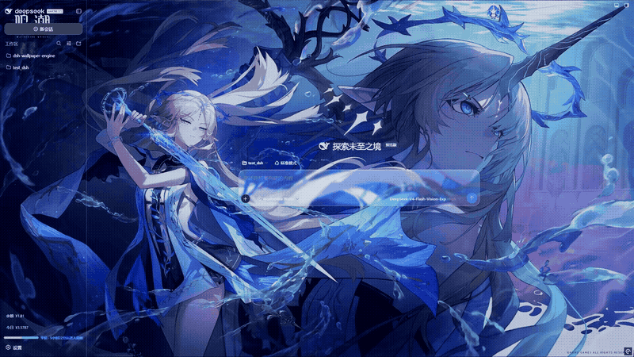
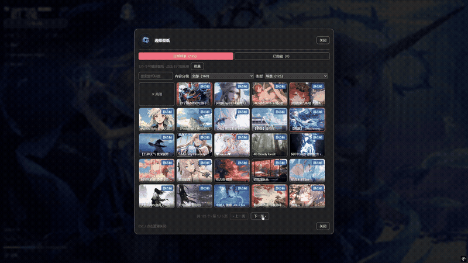

# dsh-plugin-wallpaper-engine

[English](README.en.md) | [中文](README.md)

> 🆕 **没用过命令行？先看这里：[小白向使用指南（新手快速上手）→](README.beginner.md)** —— 给完全没接触过命令行的用户准备的简化说明。

一个 DSH bundle，把你电脑上的 **Wallpaper Engine** 壁纸变成 **DSH 网页界面（`dsh web`）的背景**。

> ✅ **已优化：沉浸式全屏窗口偶尔全屏闪白**（v0.6.4，保留完整毛玻璃）
> 早期版本在**桌面快捷方式打开的沉浸式全屏窗口**（独立应用 / kiosk 窗口）里，点击对话或输入文字时**可能整屏闪白一下**——这是该窗口 + 硬件加速下，Chromium 合成器对壁纸重绘时偶发把整屏画白。
> **v0.6.4 继续按「减少合成层」处理**：仓库面板关闭时懒加载、拉绳无永久滤镜、壁纸媒体默认下不再强制一个变换合成层——同时**完整保留毛玻璃**；普通浏览器标签页完全不受影响，保持完整毛玻璃与硬件加速。
> 插件更新后会弹一次提示，告知此优化（每个新版本仅出现一次）。

它会自动发现你本机的 Wallpaper Engine 安装，列出你的壁纸，并把*可移植*的类型渲染到 DSH 对话界面的后方，配以 **iOS 风格液态玻璃**效果：Video（`.mp4`）动态播放、Web/HTML 以 iframe 加载，**Scene（场景）由内置的 WebWallGL 实时 WebGL 引擎渲染（粒子/脚本/视差/包内音频，失败自动回退场景帧）**。v0.2 起还支持：

- **壁纸选择弹窗**：缩略图网格收纳进独立弹窗，设置页不再被长列表占满；
- **隐藏 / 恢复**：不想看的壁纸一键隐藏（软删除），随时恢复，不碰源文件；
- **视频倍速**：0.5x – 2x 六档原生调速，即时生效、不重载；
- **水平翻转**：镜像画面（视频 / 网页 / 上传图片均适用）；
- **自定义壁纸**：直接上传本地 JPG / PNG / MP4 当壁纸，可选存储位置与画面适配模式；上传的 MP4 自动生成抽帧缩略图；**存储位置里的 WE 壁纸目录**（含 `project.json` 的场景/网页/视频项目目录，如 WallpaperEM 的下载目录）也会被自动收录——其中的场景壁纸同样走实时渲染与静态帧链；
- **场景壁纸完整场景帧**（v0.6）：Scene 壁纸由纯 JS 场景渲染器完整重放（对象树/纹理/粒子/shader 效果），不再是主纹理静态帧。
- **场景壁纸实时渲染**（v0.8）：Scene 壁纸改由内置 **WebWallGL** 引擎（`lib/webwallgl/`，MIT，源自 [webwallgl](https://github.com/oneincase/webwallgl)）实时 WebGL 渲染——粒子系统、puppet 骨骼模型、SceneScript 脚本、**鼠标视差/点击交互**、包内音频与音频反应完整还原，帧率上限三档（15/30/60fps）。渲染页跑在同源隔离 iframe 中并有**心跳看护**：首帧超时或运行失联自动降级回「内嵌 MP4 → 静态帧」旧链（按壁纸记忆失败，设置里重开开关即重试）。
- **液态玻璃设置页**（v0.3.1）：设置页升级为**一级设置页**（参照 dsh-web-ui-all 皮肤中心的设计），整页是可自定义的液态玻璃卡片 —— **配色**（6 种预设 + 自定义取色）与**玻璃透明度**（0–60%）即时生效、持久保存。
- **整个设置窗口液态玻璃化**（v0.3.2）：一键把 **DSH 原生设置窗口整体**（对话框 + 左侧导航 + General / 模型 / 插件等**全部原生分区**）换成液态玻璃 + 自定义配色 —— 开启「设置窗口液态玻璃」开关后，窗口背景、导航选中/悬停、按钮、开关、链接等全部跟随 **配色** 与 **玻璃透明度**，关闭则恢复原生样式。
- **玻璃调节统一**（v0.3.3–v0.3.5）：设置窗口的玻璃模糊与**对话栏共用同一套调节参数**（「玻璃」滑动条 0–60 px 同时控制设置窗口与输入栏/气泡的模糊半径，饱和度/亮度/对比度配方一致）；新增「**玻璃颜色**」—— 设置窗口玻璃的**底色色调**可自定义（6 预设 + 自定义取色，默认浅色白 / 深色深夜蓝，选定后两种主题统一使用该色），与「配色」（交互元素）分工：**配色管控件、玻璃颜色管玻璃本身**。
- **设置持久化到宿主端文件**（v0.4.0）：全部设置（已选壁纸、配色、透明度、布局、轮播、隐藏、倍速/翻转等）改存 `~/.dsh-wallpaper-engine/config.json`，不再依赖浏览器 localStorage —— **重启、换端口（含 DSH Desktop 的随机端口）、清浏览器数据、换浏览器都不再丢失**；旧版 localStorage 配置首次启动自动迁移。
- **Edge 兼容渲染**：Edge（且仅 Edge）会在页面里任何"可见的 `<video>`"上绘制浏览器自带的「下载 / 投屏」悬浮工具栏，且没有官方开关可以关闭；插件因此在 Edge 中默认把视频壁纸改为 **canvas 渲染**来规避。「紧凑布局」同一行右侧新增「**Edge 兼容**」开关（默认开启），关闭后所有浏览器一律回退到原生 `<video>`。
- **媒体流句柄修复 + 扫描提速**（v0.4.1）：媒体/预览/场景帧流在客户端断开时**立即释放文件句柄**（修复反复切壁纸/刷新累积句柄、Windows 上壁纸文件被锁无法删除/移动的问题）；壁纸库扫描改**全异步**（fs.promises 线程池），不再阻塞事件循环（WSL / 大壁纸库下启动明显更快）；**WSL 支持**：自动探测 `/mnt/<盘符>` 挂载的 Windows Steam 库，WSL 里也能发现壁纸。
- **遮挡暂停（省电三档）**：类似 Wallpaper Engine 的「被遮挡时暂停」——最小化 / 切页、窗口失焦、使用电池供电时自动暂停视频壁纸，**解码引擎直接归零**；回到界面 / 接通电源自动继续（网页壁纸仅随页面隐藏被浏览器节流）。三档开关均持久保存。
- **解码帧率上限（抽帧转码）**：高帧率源（如 4K120 H.264）的硬解是 GPU 占用大头（4060 实测 1.0x 达 ~60% Video Decode）。「壁纸效果」区设置 **帧率上限**（无限制 / 60 / 48 / 30 / 24 fps），宿主端用 ffmpeg 一次性重编码为上限帧率（时间线保持 1.0x **正常速度**、与倍速完全解耦），输出 **4K 保留 + AV1**，带**下载 / 转码实时进度条**；实测 4K120→24fps 后占用从 ~60% 降至 **~15%**。ffmpeg 三档供给：显式指定 → **自动下载**（npmmirror + GitHub 双源竞速，跨平台资产表已验证）→ 系统 PATH。
- **壁纸效果调节条扩充**（v0.6.x）：「壁纸效果」区新增 **亮度 / 对比度 / 饱和度** 三个滑动条（作用于壁纸媒体滤镜），与壁纸模糊 / 暗化等配合，任意壁纸都能调到与界面融合舒服的状态；全部即时生效、持久保存。
- **字体自定义**（v0.6.7）：设置新增「字体」分区——总开关默认关闭（即 dsh 原生外观），开启后可调 **字体颜色 / 字重(100–900) / 字体族**（默认 · 雅黑 · 楷体 · 宋体 · 黑体 · 行楷 · 等宽，选项按钮以各自字体实时预览）；报错红字不受染色影响，关闭总开关即一键恢复默认。
- **壁纸透明度**（[#82](https://github.com/elysia395/dsh-wallpaper-engine/issues/82)）：「效果」区新增 **壁纸透明度** 滑动条（0–90%，越大越透）——把壁纸整层淡出、融向页面底色，即 IDEA 背景图式的「看得见但不喧宾夺主」；与暗化互补，文字可读性不受影响。
- **输入光标颜色**（[#83](https://github.com/elysia395/dsh-wallpaper-engine/issues/83)）：「字体」页签新增 **输入光标** 分区——光标颜色与壁纸相近看不清时，可从 6 种预设或自定义取色器里挑一个高对比颜色（也可选「自动」恢复 dsh 原生表现）；作用于所有输入框与可编辑区域，独立于字体自定义开关。
- **自定义上传壁纸可用性 + 播放状态如实显示**（[#84](https://github.com/elysia395/dsh-wallpaper-engine/issues/84)）：修复「自己上传的视频壁纸一片空白、也找不到继续按钮」——① 自上传内容在 `uploads/.meta.json` 里从不写 `contentrating`，过去算「未分级」而内容分级默认是 **Everyone**，于是**所有自上传壁纸默认被过滤掉**（网格里看不到、被上传流程自动应用时直接拒绝 → 壁纸层空白 + 播放按钮变灰）；现在未标注分级的自上传内容按 **Everyone** 处理，自己的文件开箱即用，显式标注 G / PG13 / R 的照常过滤。② 视频 `play()` 被拒（自动播放策略、浏览器解不了的编码如 HEVC/10-bit、被紧接着的 src 切换打断）时过去**静默吞掉**，面板继续写「播放中」、卡片上只有「暂停」—— 壁纸冻在首帧却无「继续」可点；现在按 `<video>` 的**真实状态**显示，按钮回到「播放」可重试并给出原因（如「无法解码这段视频，建议改用 H.264」），并在媒体就绪后**自动补一次播放**（play() 被换源打断是最常见的冻结原因）。③ 被过滤条件丢弃的当前壁纸不再是无解释的空白，卡片上会写明是哪一项过滤挡住的。



> 壁纸 + 磨砂遮罩 + iOS 液态玻璃，渲染在 DSH 界面后方。

## ⚠️ 更新前置条件：① DSH 内核最新 ② better-sidebar 最新（v0.7.2 起）

**两个前置条件都满足之前，请勿更新本插件。** v0.7.2 适配 DeepSeek Harness **0.1.5-rc.1**（对应 **DSH Desktop ≥ 2.0.7**），并要求 **dsh-better-sidebar ≥ 0.19.0**（0.19 起右侧栏接入 DSH 0.1.5 的官方原生侧栏；仍停留在 0.1.2-rc.1 旧内核的用户请保持 better-sidebar 0.18.x，不要混搭）。正确的更新顺序：

1. **先把 DeepSeek Harness / DSH Desktop 更新到最新版**：DSH Desktop 在「顶部导航栏 → 版本信息」检查更新，或到 [GitHub Releases](https://github.com/anywhere-labs/dsh-desktop/releases) 下载对应平台安装包；
2. **再把 dsh-better-sidebar 更新到 0.19.0+**：`dsh plugin --profile web add dsh-better-sidebar@latest`；
3. **最后更新本插件**：`dsh plugin --profile web add dsh-plugin-wallpaper-engine`（或插件市场里点更新）。

> 💡 同时建议把**其它 DSH 插件也一并更新**：旧版插件在 harness 0.1.5 下可能直接加载失败（实测旧版 dsh-better-sidebar 在 0.1.5 下会因 API 变更异常）。

顺序反了时，把内核与 better-sidebar 各自更新到匹配版本即可恢复；无需回滚本插件。插件更新后会在界面里弹一次提示（每个新版本仅出现一次），漏看也没关系。

> 🐛 **v0.7.2 修复「右侧栏完全透明」并把玻璃扩展到官方原生右侧栏**：harness 0.1.5 的官方原生右侧栏面板直接绘制 `--dsw-alias-bg-base`——这正是本插件为露出壁纸设成透明的 token，且官方面板没有自己的毛玻璃，导致升级 better-sidebar 0.19 后右侧栏整体透明。v0.7.2 起官方原生右侧栏纳入「侧栏液态玻璃」适配：同一组**侧栏模糊 / 透明度 / 玻璃颜色**滑杆生效，总开关关闭时回退主题面板色（不再透明）。

> ✅ **v0.7.1 已在 DSH Desktop v2.0.5（harness 0.1.2-rc.1）上完成实测**：壁纸宿主路由（inventory / media / scene-frame）、设置一级分区、选择器弹窗、视频与场景壁纸播放、拉绳抽屉、液态玻璃在「兼容模式」与「增强模式」下均正常。本插件依赖的 slots / webserver / 主题变量等 API 在 0.1.2-rc.1 → 0.1.5-rc.1 之间经实测同样稳定。
>
> 🐛 **v0.7.1 修复 rc.1 的「色板 / 黑胶唱片变圆角矩形」**（[#74](https://github.com/elysia395/dsh-wallpaper-engine/issues/74)）：rc.1 主题层新增 `corner-shape.css`，给**所有元素**统一加了 `corner-shape: superellipse(1.5)`（方圆形角），任何 `border-radius:50%` 的正圆都被渲染成圆角矩形。插件现已对自身绘制的全部正圆 / 胶囊控件（色板、黑胶唱片、滑杆圆点、开关滑块、字体 chip 等）显式重置 `corner-shape: round`，在旧版 harness 上该声明会被自动忽略、无副作用。

## 支持哪些壁纸类型？

Wallpaper Engine 的壁纸分四种类型：

| 类型 | 由谁渲染 | 能否搬到 DSH |
|---|---|---|
| **Scene（场景）** | Wallpaper Engine 自带的 3D 引擎 | ✅ 实时渲染 — 内置 WebWallGL WebGL 引擎（粒子/脚本/视差/包内音频）；失败自动回退场景帧 |
| **Web（网页）** | Wallpaper Engine 内置的 HTML/JS 运行时 | ✅ 实时渲染 — 内置 WebWallGL 的网页挂载 + **注入 WE API**（音频监听/属性/媒体），严格沙箱隔离；失败自动回退兼容 iframe |

Scene 壁纸由本插件内置的 **WebWallGL 实时渲染引擎**（`lib/webwallgl/`，MIT，上游 [webwallgl](https://github.com/oneincase/webwallgl)）在 WebGL2 里完整重放：解析 `scene.pkg` 的对象树，实时渲染全部 image 层（waterwaves/waterripple 等 shader 效果按 HLSL 转译后在 GPU 执行）、puppet 骨骼模型、粒子系统与文本对象，并执行场景自带的 SceneScript 脚本 —— 鼠标移动会驱动视差 / 光标交互，包内音频（BGM / 音效）随「音量 / 壁纸音轨」设置播放并驱动音频反应效果。

**网页壁纸**同样走 WebWallGL：宿主把 **WE API shim**（`wallpaperRegisterAudioListener` / `wallpaperPropertyListener` / 媒体监听等，来自上游 `web-shim.js`，由 `/scene-files` 注入入口 HTML）交给渲染页加载 —— 依赖 WE API 的工坊网页壁纸（音频可视化、属性驱动、鼠标跟随等）因此能真正跑起来，不再是一片空白或报错。**安全**：壁纸 iframe 强制 `sandbox="allow-scripts"`（严格沙箱），第三方 HTML 拿不到 DSH 的 origin（无法冒用宿主身份调宿主 API / 读宿主存储）；跨源控制与指针注入经渲染页的 `postMessage` 通道下发。加载失败或运行失联时按壁纸记忆并自动退回旧的兼容 iframe（裸 HTML，无 WE API）。
>
> **载荷来源（独立媒体源）**：网页壁纸的入口 HTML 与全部子资源由宿主**自建的独立 loopback 媒体源**（`127.0.0.1` 上的随机端口，见 `GET /wallpaper-engine/media-origin`）提供，**不走**插件的 HTTP 路由。原因：DSH Desktop 给每条插件路由都套了能力头栅栏（`x-dsh-desktop-renderer`，只注入给同源 frame 发出的请求），而严格沙箱 iframe 是不透明源、永远拿不到这个头 —— 壁纸入口会一律 `403 Forbidden`（表现：预览图先正常、随后整块黑）。媒体源不经过该栅栏，第三方 HTML 也因此连宿主 origin 都不沾边，沙箱之外又多一层隔离。
>
> **帧率上限与「卡」的排查**：网页壁纸的 rAF 上限由 shim 按**跳帧**实现 —— 每帧都与显示器 vsync 对齐、只把第 n 帧交给壁纸（`setTimeout` 定时器式实现会产生 17/33/50ms 抖动，观感更差）。实时渲染期间每 5 秒往诊断文件写一条 `live-fps`：`ui=` 整页帧率、`web=` 壁纸自身帧率、`rnd=` 渲染页帧率、`cap=` 当前上限 —— 「限了 30 还是卡」时先看这条：只有 `web` 低＝壁纸自己的开销；`ui` 也低＝整页代价（例如侧栏液态玻璃的 `backdrop-filter` 每帧重采样壁纸，可先把模糊调小验证）。


**抓帧几何校验（视口宽高比）**：抓帧是「抓帧那一刻渲染页视口的构图」—— 渲染器按画布比取景（与场景设计比 2% 内 → 整张设计上屏，否则按画布比 cover 裁切），而静态帧上屏时还要再经 CSS `object-fit: cover`。所以**在别的窗口 / 旧会话抓的帧**拿到当前窗口上屏会被再裁一次：实测一张 1440×960（3:2）的帧在 2488×1376 视口里只显示场景设计宽度的 84.5%（对 CPU 帧做最佳匹配拟合得到），人物比 live 大约 19% 且四周被切。因此宿主在 `HEAD /scene-frame/<token>` 上附带 `X-WE-GPU-W/H/AR`（读 PNG 的 IHDR，纯文件头，不触发提取），客户端拿它与当前视口比对照：相对差 > 2%（与渲染器自己的 fit 容差同口径）或几何未知（旧宿主 / 文件读不出）→ **先抓帧过内容门禁，再清槽、再 PUT**（清槽在抓帧之后：抓帧失败时留下空槽会退回 CPU 帧，比留一张旧构图的帧更糟），落地后就地重挂屏上静帧并记 `gpu-frame-stale` / `gpu-frame-recaptured` 诊断行。旧帧因此会在下次挂载 / 轮换时自愈，不必手动清理。

**空帧门禁与清除通道**：体积阈值不可靠（headless 实测全黑 PNG：960×540≈12KB、1080p≈44KB、4K≈165KB，都远超固定字节闸），因此抓帧前会把 canvas 降采样到 64×64 看亮度分布 —— 近全黑或几乎无对比度判为「还没渲染出画面」，直接放弃回填（保留 CPU 帧），另加分辨率相关的体积地板（≈0.02 B/px）。抓到不满意的一帧时，在**设置 → 效果 → 画面 → 「GPU 实时帧」**点「清除 GPU 帧」即可（等价于 `DELETE /wallpaper-engine/scene-frame-cache/<token>`，或 `POST …?clear=1`）—— 删后 HEAD 回到 `X-WE-GPU: 0`、当前档位立即生效、下次 live 会重新抓取。该行只在缓存里确实存在 GPU 帧时出现（面板用 HEAD 探测，30s 去重）。

**测试**：`npm run verify`（client/转码/播放控制/scene/scene-live 五套）+ `npm run smoke`（轮换、轮换-live 节点级领养、轮换准备期零驻留、GPU 回填抓帧、抓帧身份校验五套冒烟）—— 所有断言都有失败通道（不通过即非零退出），`npm run verify:all` = 构建 + 两套全跑。

> **网页壁纸已知边界**：作者脚本的 `fetch`/`XHR` 在 opaque origin 下携带 `Origin: null`（宿主已返回 `Access-Control-Allow-Origin: *`，常规资源可用）；`wallpaperMediaIntegration`（系统 Now Playing / 歌曲封面）已提供数据源，详见下文「系统音频反应与歌曲信息」；CSS `:hover` 等由浏览器 hit-test 驱动的交互不受外部指针注入影响（与上游文档一致）。

> **渲染形态与降级**：渲染页在同源隔离 iframe 中运行，并有**心跳看护** —— 首帧 15 秒超时、或运行期连续 20 秒无帧（含一次自动恢复尝试）即判定失败，按壁纸记入失败记忆并自动降级到「内嵌 MP4 → 静态帧」旧链；松散 `scene.json` 目录与无 WebGL2 的环境直接走旧链。失败记忆可在设置里重新打开「场景实时渲染」开关清空重试。静态帧链（内置纯 JS 场景渲染器，下节）保留为垫底画面与降级目标。

> **展现效果**：渲染器输出 3840×2160 完整场景帧（背景+水+后发+人物+伞+粒子），对摄影、插画、动画截图类场景壁纸效果接近原版；渲染失败（纯 shader 生成类/特殊纹理格式）时自动回退旧的主纹理提取，再失败回退工坊预览图（`preview.jpg`），属预期行为，不视为缺陷。

### 静态帧兜底：怎么工作的

- **对象树**：解析 `scene.pkg`（PKGV 容器 + LZ4 条目链）或松散 `scene.json` 目录，按 dependencies/parent 拓扑排序全部对象（image / particle / text / sound）。
- **image 层**：加载材质主纹理（RGBA8888 / DXT1/3/5 等），按 scene 坐标定位（origin/scale/angle 父链累积），应用 alpha/brightness。
- **puppet 网格**：MDL（MDLV）网格 + 绑定姿态光栅化（软件光栅 + 双线性 UV 采样 + 透明合成），人物/后发等骨骼模型正确显示。
- **shader 效果链**：waterwaves（含 DUALWAVES 双波乘积）/ waterripple / shake 按 shader 精确数学在 CPU 实现；mask 纹理支持。
- **粒子系统**：boxrandom/sphererandom 发射器、color/size/alpha/lifetime/velocity/rotation 等初始化器、movement/alphafade/sizechange/turbulence/oscillate* 等运算符、sprite 精灵绘制。
- **图集黑边会裁掉**：场景主纹理常是 2048²/4096² 的 2 的幂次方**图集**，画面只占其中一条带、其余纯黑。静态帧按画面本身裁剪（四周连续黑边裁掉，裁完过小则放弃），所以加载期用它当占位图时能正常铺满屏幕，而不是以图集中心铺满、屏幕上一大片黑。
- **缓存**：渲染结果按 `<版本>_<路径>_<mtime>` 缓存到 `~/.dsh-wallpaper-engine/cache/frames/`（可用 `DSH_WE_CACHE_DIR` 覆盖），工坊更新后自动失效重建；首次渲染约 3-4 秒，之后秒级命中。

## 工作原理

- **Host 端**（`lib/index.js`）：一个 Cordis 插件，负责
  1. 通过读取 Steam 的 `libraryfolders.vdf` 定位 Wallpaper Engine 安装位置（所以 Steam 装在非默认盘也能用）；
  2. 从 `projects/defaultprojects`、`projects/myprojects` 以及 `steamapps/workshop/content/431960/*` 枚举壁纸；
  3. 在 DSH webserver 上注册同源 HTTP 路由，让浏览器端直接获取数据和流式加载媒体：
     - `GET /wallpaper-engine/inventory` → 壁纸 JSON 列表
     - `GET /wallpaper-engine/media/<token>` → 视频 / HTML（支持 Range）
     - `GET /wallpaper-engine/preview/<token>` → 预览图
     - `GET /wallpaper-engine/video-preview/<token>` → 自上传 MP4 的按需抽帧缩略图（ffmpeg，磁盘缓存）
     - `GET /wallpaper-engine/scene-frame/<token>` → 场景壁纸完整场景帧（纯 JS 渲染器输出 3840×2160，失败回退主纹理提取，PNG 磁盘缓存；同时是实时渲染的垫底画面）
     - `GET /wallpaper-engine/scene-live/*` → 内置 WebWallGL 渲染页（vendor 产物 `lib/webwallgl/`，实时渲染 iframe 加载）
     - `GET /wallpaper-engine/scene-files/<token>/<path>` → 场景壁纸原始文件（`scene.pkg` / `project.json` 等，支持 Range；渲染页自行解析容器）。同一条路径还挂在**独立媒体源**上（见上），网页壁纸的入口 HTML 与其子资源从那里取
     - `GET /wallpaper-engine/media-origin` → 上报当前壁纸媒体源地址（诊断用：网页壁纸到底从哪个源加载）
     - `POST /wallpaper-engine/upload` → 上传自定义壁纸（JPG / PNG / MP4，原始字节流）
     - `POST /wallpaper-engine/remove` → 移除已上传的壁纸
     - `POST /wallpaper-engine/upload-dir` → 更改上传目录（持久化到 `~/.dsh-wallpaper-engine/config.json`，自动迁移已有文件）
     - `GET /wallpaper-engine/settings` → 读取插件设置（v0.4.0）
     - `PUT /wallpaper-engine/settings` → 保存插件设置（v0.4.0，写入 `~/.dsh-wallpaper-engine/config.json`）
     - `GET /wallpaper-engine/media-info/<token>` → 媒体元数据（分辨率 / 编码 / 帧率 / 时长，moov 探测）
     - `GET /wallpaper-engine/transcoded/<token>?fps=N` → 抽帧转码流（ffmpeg 一次性重编码，磁盘缓存）
     - `GET /wallpaper-engine/transcode-progress/<token>?fps=N` → 下载 / 转码进度（进度条轮询）
     - `GET /wallpaper-engine/media-status` → 媒体后端状态（`backend: bridge|legacy`、音频/媒体两个数据源的 `status`/`hint`、中间件版本与后端名、以及回落原因 `fallback`；排查媒体问题时先看它）
     - `GET /wallpaper-engine/audio-spectrum` → 64 段频谱（0–255）+ `running`（客户端据此决定要不要把频谱接管给壁纸）
     - `GET /wallpaper-engine/now-playing` → 当前曲目（歌名/歌手/专辑/专辑艺术家/播放态/进度秒/时长秒/歌词 `[[秒, 文本], …]`/封面路径）
     - `GET /wallpaper-engine/now-playing/artwork` → 当前封面图片（宿主代理中间件落盘的文件；带内容指纹，换曲即换名）
     - `GET /api/local-assets/*` → 按名服务官方素材（`materials/index.json` 列名、`.tex` 原样字节、fonts 后备路径），供内置渲染页取官方像素；未配置目录时 `404`，路径越界 `403`
- **Client 端**（`lib/client.js`）：一个浏览器模块，拉取壁纸列表，把选中壁纸渲染到应用三列**后方**的固定图层，并在「设置」里注册一个**一级设置页**「Wallpaper Engine」（含液态玻璃卡片、选择弹窗、隐藏/恢复、倍速/翻转、配色/透明度与自定义壁纸管理）。
- **自定义壁纸存储**：上传的文件写入插件管理的本地目录（默认 `~/.dsh-wallpaper-engine/uploads`，可在设置里改到任意盘符），经同一套 `/media`、`/preview` 路由服务（视频缩略图另走 `/video-preview`）——与 WE 媒体走完全相同的管道，天然跨重启持久、无浏览器配额限制。存储位置同时支持 **WE 项目目录**：子目录里含 `project.json`（`scene.pkg` / `scene.json` / `index.html` / `*.mp4`）即被识别为对应类型的壁纸（场景壁纸可实时渲染），扫描按目录分块异步执行（数百目录约 30ms）；这些目录只读收录，不参与上传管理与「移除」（不会误删你的库）。

## 设置持久化（v0.4.0）

**你的全部设置（已选壁纸、配色、透明度、布局、轮播、隐藏、倍速/翻转等）从 v0.4.0 起保存在宿主端文件里，不再依赖浏览器 localStorage。**

- **存在哪里**：`~/.dsh-wallpaper-engine/config.json`（与「上传目录」的配置是同一个文件）。具体位置：
  - Windows：`C:\Users\<你的用户名>\.dsh-wallpaper-engine\config.json`
  - WSL / Linux / macOS：`~/.dsh-wallpaper-engine/config.json`
- **为什么改**：此前设置存在浏览器 localStorage，而 localStorage 按「地址 + 端口」隔离——**DSH Desktop 每次启动用随机端口**，等于每次进入一个全新的存储空间，配置全部恢复默认（Web 端固定端口则无此问题）。改存宿主端文件后与端口无关。
- **带来的好处**：重启 / 换端口 / 清浏览器数据 / 换浏览器 / 无痕模式都不再丢失配置。
- **旧数据迁移**：老版本存在 localStorage 里的配置会在**首次启动时自动迁移**到该文件，无需任何手动操作。
- **需要知道的行为变化**：同一台电脑上，多个浏览器（如 Chrome 和 Edge）或手机等设备访问同一个 dsh 时，**共享同一份配置**（此前各存各的）；如果你回滚到旧版本，它仍会读取 localStorage 里的缓存副本，配置不会丢。
- **配置文件的读写**：每次修改设置会自动写入（200ms 防抖合并）；文件损坏时插件回退默认值且不会覆盖你的文件。

## 安装

### 普通用户（安装已发布版本，推荐）

如果你只是想用这个插件，直接装 npm 上已发布的包即可：

```sh
dsh plugin --profile web add dsh-plugin-wallpaper-engine
```

装完重启 `dsh web`，打开 **设置 → Wallpaper Engine** 就能用。

> **macOS 用户**：macOS 没有 Wallpaper Engine 客户端，本插件的 macOS 版（WaifuX + 散装媒体支持）由社区维护者 Jerry 维护，发布为独立 npm 包：
>
> ```sh
> dsh plugin --profile web add dsh-plugin-wallpaper-engine-mac
> ```
>
> 仓库：https://github.com/ruijiaang-lab/dsh-wallpaper-engine

### 开发者（运行你本地的一份代码）

**大多数读者可以跳过本节。** 只有当你打算自己改这个插件的代码时才需要。下面的步骤假定你已了解命令行、以及「仓库 / repository」是什么（一份用 Git 做版本管理的代码文件夹）。

**第 1 步：取得源码（checkout）**

> 这里 *checkout* 的意思很简单：就是「把源代码下载/复制一份到你电脑的某个文件夹里」。通常在这个 GitHub 页面点 **Code → Download ZIP** 下载并解压，或用 Git 克隆：
>
> ```sh
> git clone https://github.com/elysia395/dsh-wallpaper-engine.git
> ```
>
> 完成后你会得到一个包含 `package.json`、`lib/`、`src/`、`cordis.patch.yml` 的文件夹。下文把这个文件夹称作**插件文件夹**。

**第 2 步：用文件夹路径安装（link:）**

> 这里的 *`link:`* 表示：告诉 `dsh`（它会把命令转发给 pnpm）去**连接你本地那个插件文件夹**，而不是从网上下载一个包。好处是：你改完代码并重新构建后，改动能直接生效，不用反复重装。

把下面命令里的 `<插件文件夹绝对路径>` **替换成你插件文件夹的完整路径**（就是你在资源管理器/文件管理器里打开那个文件夹时，地址栏显示的那串路径）：

```sh
dsh plugin --profile web add link:<插件文件夹绝对路径>
```

**具体示例**——假设你的插件文件夹路径像 `D:\dev\dsh-wallpaper-engine` 这样：

```sh
dsh plugin --profile web add link:D:\dev\dsh-wallpaper-engine
```

如果你已经用命令行 `cd` 到了插件文件夹的上一级，也可以用相对路径：

```sh
dsh plugin --profile web add link:./dsh-wallpaper-engine
```

> **该填哪个确切的路径？** 必须是**包含 `package.json` 的那个文件夹**——不是 `package.json` 文件本身的路径，也不是它里面任何单个文件的路径。它就是你在资源管理器地址栏里打开那个文件夹时显示的那串路径。

> 为什么推荐 `link:` 而不用 `file:`？`link:` 是和你的源码文件夹**建立实时连接**，改完 `src/client.js` 并 `npm run build` 后直接生效，无需重装；`file:` 则是打包成一份静态快照，每次改动都要重新 add。首次安装两者都可以。

然后重启 `dsh web`。host 端会成为 bundle 层，client 端会自动加载（`dsh.client.immediately: true`）。

如果 Steam 装在非标准位置，host 会通过 `libraryfolders.vdf` 自动探测，无需额外配置。

### 安装失败排查

`dsh plugin --profile web add ...` 会把命令转发给 **pnpm**。如果你遇到下面的错误：

```text
[ERR_PNPM_UNEXPECTED_VIRTUAL_STORE] Unexpected virtual store location
dsh: pnpm failed in profile directory C:\Users\xxx\.dsh-desktop\profiles\web
```

**这不是插件本身的问题**（换任何一个插件安装都会失败），而是该 profile 目录的 pnpm 依赖状态失效了：pnpm 在 `node_modules\.modules.yaml` 里记录了安装时的虚拟存储位置（绝对路径），一旦 profile 目录被**移动 / 复制 / 备份恢复**过，或 pnpm 版本 / `virtual-store-dir` 配置发生变化，记录值与当前路径不一致，pnpm 就会拒绝继续安装任何插件。

**修复（Windows PowerShell）：**

```powershell
# 1) 先退出 DSH 桌面端
# 2) 删除该 profile 的依赖目录（只删 node_modules 即可，配置/已装插件名不会丢）
Remove-Item "$env:USERPROFILE\.dsh-desktop\profiles\web\node_modules" -Recurse -Force
# 3) 重新安装本插件
dsh plugin --profile web add dsh-plugin-wallpaper-engine
```

> 只删除 `node_modules\.modules.yaml` 一个文件也能修复（pnpm 会自动重建并继续），删除整个 `node_modules` 更彻底。如果 `.dsh-desktop` 被 OneDrive / 云同步 / 迁移工具动过，建议把它加入同步排除，避免复发。

如果遇到下面的错误：

```text
[ERR_PNPM_GIT_DEP_PREPARE_NOT_ALLOWED] ... The git-hosted package "dsh-plugin-wallpaper-engine@0.6.8"
needs to execute build scripts but is not in the "allowBuilds" allowlist.
```

**说明你用了 `github:` 形式的安装命令**（例如 `dsh plugin --profile web add github:elysia395/dsh-wallpaper-engine`）。pnpm 11 出于供应链安全，默认拒绝从 git 安装的包执行构建脚本，而本插件的 git checkout 需要 `prepare` 脚本构建 client，因此 `github:` 直装必然失败。请改用 **npm 包名**安装（npm 发布包已预构建，无需安装时编译）：

```sh
dsh plugin --profile web add dsh-plugin-wallpaper-engine
```

> 如果你的插件中心（dsh-plugin-hub）生成的是 `github:` 命令，请把它升级到 **v1.4.1+**——新版会自动反查 npm 包名并切到 npm 通道。

## 使用

1. 打开 `dsh web`，进入 DSH 界面。
2. 打开 **设置**，左侧导航里找到 **Wallpaper Engine**（一级设置页，侧边栏独立入口）。
3. 点击 **选择壁纸** 打开选择弹窗，在缩略图网格里点选一张 Video/Web 壁纸（或上传的图片/视频），它会出现在界面后方；点遮罩、按 ESC 或点「关闭」收起弹窗。Scene/Application 无法内嵌网页，不显示在网格中。
4. 用 **暂停/播放** 暂停视频壁纸，用 **关闭** 清除壁纸。
   选择会保存在浏览器的 `localStorage`（键 `dsh-wallpaper-engine:selection`）中。


> 设置界面：液态玻璃卡片、六页签分区（壁纸 / 外观 / 字体 / 吉祥物 / 效果 / 高级）。



> 选择弹窗：浏览全部壁纸缩略图，支持批量隐藏与已隐藏恢复。

### 六大调节页签

设置页与吉祥物抽屉共用同一套**顶部分类页签**——所有调节项按用途归入六个域，每页只保留 3–8 个相关控件，不再是一列三十项的长滚动：

| 页签 | 收录内容 |
|---|---|
| **壁纸**（默认） | 当前壁纸卡片（黑胶 + 选择壁纸 + 暂停/关闭/刷新）、自动轮播、自定义壁纸 |
| **外观** | 配色、玻璃颜色、玻璃透明度、设置窗口液态玻璃、侧栏玻璃与内容面 |
| **字体** | 字体自定义开关与颜色 / 字重 / 字体族、输入光标颜色 |
| **吉祥物** | 显示开关、形态卡片（立绘即实时预览）、大小滑条 |
| **效果** | 壁纸模糊 / 亮度 / 对比度 / 饱和度 / 壁纸透明度 / 暗化 / 边框 / 玻璃、倍速、帧率上限、适配、水平翻转、遮挡暂停（未启用壁纸时显示引导空态） |
| **高级** | 紧凑布局、Edge 兼容 |

页签指示胶囊随选中项平滑滑动；设置页与壁纸仓库抽屉的页签各自独立记忆（存在浏览器 `localStorage`，不进配置文件）。长说明一律收进控件悬停提示（tooltip），行内只保留一句话简述。

### 隐藏与恢复（软删除）

每张壁纸卡片右上角有「隐藏」按钮——只是从列表移除，**不删除任何源文件**。需要时在弹窗的「已隐藏」标签里单张**恢复**或**全部恢复**；弹窗工具栏的「批量」进入多选模式，可一次隐藏多张。隐藏状态保存在浏览器 `localStorage`，刷新 / 重启不丢；隐藏当前正在播放的壁纸不会打断播放，自动轮转也会跳过被隐藏的壁纸。

### 内容分级与类型过滤

选择壁纸弹窗的网格上方有两个下拉框，复刻 Wallpaper Engine 自己的分类方式：

- **内容分级** —— 读取每张壁纸的 `contentrating` 字段（WE 壁纸读 `project.json`，自上传内容读 `uploads/.meta.json`，即 WE workshop 的 G / PG13 / R 三档标签）：**全部** / **Everyone（G，默认）** / **PG13（家长指导级）** / **Mature（R）** / **未分级**（没有该字段的壁纸，通常是本地项目）。自上传内容未标注分级时按 **Everyone** 处理（[#84](https://github.com/elysia395/dsh-wallpaper-engine/issues/84)：否则默认过滤会把用户自己的文件全部藏起来，网格里看不到、也无法被选中）。
- **类型** —— 按可内嵌类型筛选：**全部** / **视频** / **网页** / **图片**（自上传）。

每个选项都带当前可播放壁纸数量；被过滤的壁纸会从网格、轮播编辑器和轮播候选中整体剔除，也不会被自动选中或轮换。选择保存在浏览器 `localStorage`；默认 Everyone 对应 WE 保守的首启立场。

> 说明：分级读取自壁纸文件里的 `contentrating` 字段，与 WE 客户端界面显示的分级一致，但**不会**跟随 WE 客户端里成人内容开关的状态（插件直接扫描磁盘，不读 WE 的配置）。

### 卡片样式与黑胶唱片

- **紧凑布局**：「高级」页签里有一个**滑动开关**。开启后为 **CD 架效果** —— 卡片像 CD 盒一样纵向层叠（下排上沿盖住上排下沿、左右不遮挡），鼠标悬停放大置顶；网格更紧凑（每行约 7 个）且**一页到底不翻页**。关闭则为常规网格（固定高度防重叠 + 分页，默认）。选择保存在浏览器 `localStorage`。
- **黑胶唱片**：选择壁纸界面旁边有一个**旋转的黑胶唱片**，把当前选中壁纸的封面当作唱片标签展示 —— 播放时旋转、暂停即停（系统开启「减少动态效果」时停用动画）。弹窗头部也保留小号黑胶。该效果在**经典与新版两种卡片样式下都显示**。

### 视频倍速与水平翻转

选中视频壁纸后，「效果」页签出现 **倍速** 档位（0.5x / 0.75x / 1x / 1.25x / 1.5x / 2x）——基于浏览器原生 `playbackRate`，即时生效、不重载不黑屏（壁纸视频本就静音，无需担心音画同步）。**水平翻转** 开关对视频、网页与上传的图片/视频都生效，镜像通过 CSS `scaleX(-1)` 完成，零主线程开销。

### 遮挡暂停（省电三档）

类似 Wallpaper Engine 的「被遮挡时暂停」——桌面端大部分时间 GPU≈0 的主因。浏览器无法直接探测"被窗口遮挡"，插件用三个最接近的信号（「效果」页签开关，即时生效、持久保存）：

| 开关 | 默认 | 行为 |
|---|---|---|
| **最小化/切页时暂停** | 开 | 页面隐藏（窗口最小化 / 切走标签页）时暂停视频，解码引擎直接归零——浏览器对后台页的节流并不保证停解码，显式 `pause` 才彻底 |
| **窗口失焦时暂停** | 关 | 切到其它应用（壁纸很可能被遮挡）时暂停 |
| **使用电池时暂停** | 关 | `navigator.getBattery` 判定在电池供电时暂停（不支持的浏览器自动无操作） |

恢复可见 / 聚焦 / 接通电源后自动继续（除非用户手动暂停过）。仅对视频壁纸生效——网页（iframe）壁纸无法从外部暂停，仅随页面隐藏被浏览器节流。

### 解码帧率上限（抽帧转码）

高帧率源（如 4K120 H.264）的硬解是 GPU 占用大头（4060 实测 1.0x 可达 60% Video Decode 占用）。「壁纸效果」区的 **帧率上限**（无限制 / 60 / 48 / 30 / 24 fps）通过**宿主端一次性抽帧重编码**解决：ffmpeg 把源视频转为上限帧率（时间线保持 1.0x **正常速度**，与倍速完全解耦），输出 **4K 保留 + AV1**（NVDEC 上 AV1 解码吞吐约为 H.264 的两倍）并缓存到 `~/.dsh-wallpaper-engine/cache/transcodes/`。

- 播放时**先播原片、转好自动切换**；设置页显示**实时进度条**（下载 ffmpeg % → 转码 % 含预计剩余秒数 → 收尾 → 自动切换），首次约几十秒（含可能的 ffmpeg 下载），之后同壁纸秒开
- 源帧率 ≤ 上限自动跳过；转码失败自动回退原片，不影响任何现有功能
- 实测 4K120 → 24fps AV1 后 GPU 占用从 ~60% 降至 **~15%**
- 转码按 路径+mtime+上限帧率 缓存，轮转里每张壁纸只付一次成本

**ffmpeg 供给（三档，按顺序自动探测）**：

| 档位 | 说明 |
|---|---|
| **显式指定** | 环境变量 `DSH_WE_FFMPEG` 指向任意 ffmpeg 可执行文件；或把 ffmpeg 放进插件目录的 `ffmpeg/`（如 `./ffmpeg/ffmpeg.exe`），两者优先 |
| **自动下载** | 无本地 ffmpeg 时，首次使用自动从**双源竞速**下载对应平台单文件（Windows x64 / Linux x64·arm64 / macOS x64·arm64 等，资产表已验证）：`npmmirror`（国内快）与 GitHub release（海外快）**并发下载、先完成者胜**，流式落盘 + 魔数/体积校验 + 每源 5 分钟超时，缓存到 `~/.dsh-wallpaper-engine/ffmpeg/` 后复用。可用 `DSH_WE_FFMPEG_URL` 环境变量替换下载源（自建镜像 / 代理加速） |
| **系统 PATH** | 以上都没有时使用系统 `ffmpeg`；仍不可用则该壁纸静默保持原片 |

> 转码使用 **NVENC**（`av1_nvenc`，自动回退 `h264_nvenc`），要求 NVIDIA 显卡与驱动；无 NVIDIA 时功能自动关闭（或回退 H.264 纯软件编码，速度较慢）。本机无 ffmpeg 或转码失败时功能自动关闭，无副作用。

### 壁纸属性（作者属性热更新）

当前壁纸是**场景**或**网页**壁纸时，「当前壁纸」卡片上会出现绿色的 **壁纸属性** 按钮（就在「选择壁纸」左边）。点开即列出壁纸作者在 WE 编辑器里定义的可调属性（颜色 / 开关 / 滑块 / 下拉 / 文本 / 文件），改一下**立刻生效**（渲染页 `__wp.updateWebProps`），不需要重开壁纸。

- 属性来自壁纸目录的 `project.json` → `general.properties`，文案取壁纸自带的 `general.localization`（zh-chs → zh-cht → en-us **逐键**回退）；带 `condition` 的属性按当前值显隐，作者标了 `editable: false` 的内部变量不显示（但值照常下发给壁纸，WE 语义如此）。
- 改动**会记住**（按壁纸存进设置）：刷新 / 重启后网页壁纸随 HTML 种子一起送达，场景壁纸在实时渲染就绪后回放；「恢复默认」一键清掉这张壁纸的全部改动。
- 面板显示的是**真正生效**的值 —— 值以渲染页的实时表为准（场景壁纸的默认值在场景快照里，可能与 project.json 不一致），而不是照抄 project.json。
- 实时渲染没接管时（静态帧 / 兼容模式）改动不会立刻可见，面板里会有一句提示；重新打开「实时渲染」后生效。

场景壁纸的效果链 / 材质 / 粒子按名引用的公共贴图（`util/*`、`particle/**`、`gradient/*`）**不在壁纸包里**，内置渲染页对它们默认走程序化复刻 —— 观感近似但逐像素对不上。把「官方资源路径」指向**本机 Wallpaper Engine 安装目录的 `assets` 树**（或它的拷贝）后，渲染页按名取官方像素，实时渲染与官方引擎对齐；没配置或目录无效时静默回落程序化复刻，行为与之前完全一致。

- 设置入口：「设置 → Wallpaper Engine → 效果 → 画面 → 官方资源路径」（保存后立刻重建实时渲染层生效）；也可用 `DSH_WE_ASSETS_DIR` 环境变量覆盖（优先级最高）。
- 目录要求：必须是**绝对路径**且含 `materials/` 子目录（相对路径 / 不存在的目录 / 结构不符会被拒绝并提示）。
- 素材属 WE 版权内容：**只从你本机路径只读取用**，不复制、不上传、不入库（合规边界同上游 WebWallGL `docs/COMPLIANCE.md`）。
- 契约：宿主按上游 `renderer/src/local-assets.ts` 提供四种请求形态（probe / `index.json` / `.tex` / 任意相对文件），渲染页由 URL 参数 `localAssets=1` 开启；验收见 `scripts/verify-scene-live.mjs` 的 Level E（20 条）。

### 自定义壁纸

在「自定义壁纸」区可以上传本地图片（JPG / PNG）或视频（MP4）作为壁纸：

- **存储位置**：上传文件默认保存在 `~/.dsh-wallpaper-engine/uploads`（用户主目录，通常是 C 盘）。点「更改」可把存储位置改到任意盘符（绝对路径，支持 `~`），已有文件会自动迁移过去，选择会持久化、重启不丢——不想让壁纸数据占 C 盘的用户建议改到其他盘。
- **格式限制**：仅 JPG / PNG / MP4；浏览器与宿主端双重校验，格式不符会给出明确提示。
- **视频缩略图**：上传的 MP4 在壁纸选择器里按需用 ffmpeg 抽一帧作为缩略图（跳过开头 1 秒，避免黑场），缓存到 `~/.dsh-wallpaper-engine/cache/video-previews/`；ffmpeg 不可用时回退「无预览」占位，不影响播放。
- **适配模式**：覆盖 / 填充 / 居中 / 拉伸 四种画面适配（仅对自定义壁纸生效，WE 壁纸保持原设计构图）。
- **管理**：已上传列表可单独**移除**（二次确认后删除本地文件）；上传的壁纸同样支持隐藏 / 恢复、倍速与翻转。
- **重复去重**：重复上传同一文件会自动识别（按内容校验），直接选择已有的那张，不会在仓库里堆积副本。

### 自动轮转（轮播列表）

轮转基于**自定义轮播列表**（「壁纸」页签的自动轮播分组）。用 **新建** 可以创建任意多个列表，从库存里勾选 Video/Web 壁纸加入每个列表，并为每个列表单独设置**切换间隔**（1、5、10、30、60 或 120 分钟）和**播放顺序**（顺序/随机），勾选 **自动轮转** 后只在该列表内循环。列表保存在浏览器 `localStorage`，完全在客户端维护——轮转不再依赖 Wallpaper Engine 自己的 `config.json` 播放列表路径。

每个列表至少需要 2 个可播放壁纸；手动切换壁纸会重新计算下一次轮转时间；不同列表可以有不同的间隔（比如一个每 5 分钟、一个每 30 分钟）。首次使用时，插件会自动把第一个可播放的 WE 播放列表导入成一个轮播列表，开箱即用；编辑列表时也可以用 **从 WE 播放列表导入** 把其它播放列表导入当前编辑的列表。Scene 和 Application 壁纸不能嵌入网页，会自动从轮转候选和选择器中剔除。

轮换切换是**就绪后切换**：到点先在后台把下一张壁纸准备到完全就绪（实时渲染页首帧 / 静态帧提取完成 / 视频可播放 / 图片解码完成）才落实切换，旧壁纸在准备期间原样保持；就绪瞬间新旧两层做 1.8s 交叉淡化，上屏即是活画面，不再黑屏闪烁。**手动点选切换同样走这套交叉淡化**（旧层保留被新层盖过去，等效淡出 + 音频闸防两条 BGM 在渐变期重叠）；**同一张壁纸的内部重建保持硬切**（live 降级、fps 档变更、scene-anim 完成换层、画面刷新 —— 重建前后是同一条 BGM，淡出 + 音频闸反而让它断 ~2s）。准备期的 live 首帧探测**连续 2 次超时**的候选，本会话不再对它尝试 live 准备（直接走 sceneVideo / 静态帧）：超时候选本来也进不了 live，而不设闸就要每轮重新完整拉一次 scene.pkg（宿主 no-store，无 HTTP 缓存）+ 满视口渲染最多 15s。手动选择壁纸走建层路径、不经过准备链，不受此闸影响；**准备期真的出首帧、或建层后那条 live 真的出首帧（手动点开这张壁纸跑起来了）都会清零冷却** —— 否则一张「准备期超时过、实际跑得动 live」的壁纸会被轮换一路降级到页面关闭，而用户手动点它却是活的。准备失败（如视频 404）自动跳过该候选链式尝试下一张。开发/冒烟可用 `localStorage.weRotationTestSec`（秒）临时缩短轮换间隔。

**BGM 不重叠**：交叉渐变期间两层同时在 DOM 上，且旧层刻意保持播放（真交叉淡化）——若新层立刻带音量起播，两层音乐会在 1.8s 里叠在一起。因此提交瞬间会把**新层**所有音源压到 0（`<video>`/`<audio>` 走统一音量函数、实时渲染页走 `__wp.setVolume(0)`、场景包 BGM 只装音源不播），等这次渐变对应的旧层退场（渐变结束、旧层被移除）之后才恢复：旧层音频在其可见期内照常出声，新层 BGM 严格晚于旧层退场。渐变期间改音量不影响结果 —— 恢复时读的是最新值。

**GPU 帧优先于 CPU 渲染**：`<key>_gpu.png` 存在时，除了宿主侧服务优先级（静态帧请求一律给 GPU 帧、不再触发 CPU 提取，档 1–3 通吃、档 4 自定义画面豁免），客户端也**不启动 CPU scene-anim 后台渲染**（`maybeQueueSceneAnimUpgrade`：HEAD 探测槽位 → 有 GPU 帧就不跑）—— 否则分钟级 CPU 渲染完成后会把 GPU 帧覆盖掉。live 可用时本来就不跑（实时管线已覆盖动画）。想让某张壁纸换回 CPU 画面：面板的「帧率上限」按钮同样走这道门禁（它此前是唯一的旁路直调）；改档后重新渲染完成的产物会按**基路径**判定切层，所以静态帧带画面档位、或当前已经在上屏旧档位动画时都能正常切换。面板点「清除 GPU 帧」，清除路径会重新评估并立即恢复 CPU 渲染。GPU 未就绪的首帧窗口里，垫底图就是 GPU 帧（live iframe 起始透明，首帧心跳通过才淡入——时长 1.8s，与轮换交叉淡化同口径：手动切换壁纸时「GPU 静帧 → 实时动态帧」的缓慢过渡正是这条腿，0.8s 短窗口实测过渡太急，按用户明确要求回到 1.8s；`LIVE_FIRST_FADE_MS` 保持独立常量，后续可单独调节），所以不会看到黑屏。

**领养槽位不变量（槽位寿命 = 一次建层）**：轮换准备期创建的就绪元素（``/`<video>`）通过单一槽位交给建层函数收编，但 live 分支自建 iframe、iframe 类的节点级领养整条绕过收编 —— 这两条路径下若槽里还压着元素（准备期 live 首帧 15s 探测超时 → 回退到内嵌 MP4/静态帧，提交时建层又选了 live），它既不上屏也无处释放：脱离文档的 `<video>` 是解码器根，会以满速后台解码活到页面关闭（实测 4K ≈35% 单核/个，`gc()` 收不走），而且它属于**上一张壁纸** —— 之后任何非提交重建（live 运行期失败、fps 档位切换、scene-anim 完成等）都可能按类型命中它、把它领养进当前壁纸的层（层里播上一张的画面，而选择态/`weKey` 是当前壁纸）。因此 `syncLayers` 收尾强制清空该槽位，卸载/禁用时也一并收掉在途准备与槽位。收编时还要校验**类型与目标 URL**：静态帧准备要按**提交后会显示的 URL**加载（`frameUrlWithVariant(w.frameUrl, selection.frameVariants[id])`，即带画面档位 `…?v=N`），否则档位 1–3 的探针会在收编时被判为不符 → 释放重建：预载白做、还多一次全分辨率帧下载（宿主静态帧响应 `no-store`）；不符的元素仍一律释放、按目标 URL 重建（档位在准备与提交之间被改时照旧兜住），所以读数与实际画面永远一致（视频/内嵌 MP4 两侧同源，预载收益不受影响）。

另外，**web 壁纸的 live 状态同样进层 key**（此前只有 scene 进）：否则 web 的「网页实时渲染」运行期失败后 `syncLayers` 判定 key 未变而不重建，页面会一直停在坏帧/黑帧上。

回归测试见 `test/rotation-prepared-leak-smoke.mjs`（可控时钟跨过 15s 首帧超时阈值，断言探针被真释放、无「脱离文档且仍在播」的孤儿、层内视频属于当前壁纸）。

### 液态玻璃外观（整个设置窗口 + 配色 + 透明度）

「外观」页签控制**整个 DSH 原生设置窗口**的观感（参照 dsh-web-ui-all 皮肤中心的设计）：

| 控件 | 作用 | 范围 | 默认 |
|---|---|---|---|
| **设置窗口液态玻璃** | 总开关：把设置窗口整体（对话框 + 左导航 + 全部原生分区）换成液态玻璃 | 开 / 关 | 开 |
| **配色** | 主题色：窗口内的按钮、开关、链接、导航选中、滑块与玻璃高光统一跟随 | 6 预设 + 自定义取色 | `#4f8cff` 经典蓝 |
| **玻璃颜色** | 设置窗口玻璃的**底色色调**：玻璃本身的颜色（不只是透明度） | 6 预设 + 自定义取色 | 浅色白 / 深色深夜蓝 |
| **玻璃透明度** | 玻璃面板（设置窗口、输入栏、气泡、侧边栏）的透明度 | 0–60 % | 12 % |

> 开启「设置窗口液态玻璃」后，**General、模型、插件等所有原生分区**和左侧导航都会变成同一套液态玻璃 + 配色（通过覆盖设置对话框作用域内的 shell token 实现，不侵入其他界面）。设置窗口的玻璃模糊与**对话栏使用同一套调节参数**：「玻璃」滑动条（0–60 px）同时控制设置窗口与输入栏/气泡的模糊半径，饱和度/亮度/对比度配方完全一致；**玻璃颜色**决定玻璃底色本身的色调（默认浅色白/深色深夜蓝，选定后两种主题统一使用该色），**玻璃透明度**决定浓淡，越高越"透"（壁纸颜色更清晰地透过面板），越低越接近实色。不支持 `backdrop-filter` 的浏览器自动回退到高不透明实色，保证文字可读。所有控件即时生效并保存在浏览器 `localStorage`，刷新不丢。

### 吉祥物（聊天顶部拉绳）

「吉祥物」页签控制聊天的**拉绳吉祥物**（一条可拖拽的拉绳，沿顶部吸附，向下拉即拉出**壁纸仓库**抽屉）。**形态**以卡片呈现——卡片直接渲染当前形态的立绘并按「吉祥物大小」实时缩放，选形态与看大小在同一处完成：

| 控件 | 作用 | 范围 | 默认 |
|---|---|---|---|
| **显示吉祥物** | 是否显示拉绳吉祥物与其壁纸仓库抽屉 | 开 / 关 | 开 |
| **吉祥物形态** | 切换吉祥物立绘：默认**小女仆**（近方形 chibi）或**鲸御姐**（竖版 2:3 全身体） | 小女仆 / 鲸御姐 | 小女仆 |
| **吉祥物大小** | 缩放吉祥物（拉绳盒尺寸随比例变化，拖拽 / 吸附几何自动适配） | 0.5×–2.5× | 1× |

> 两幅立绘在打包时都已内联为 base64（透明背景），单文件客户端资源依然自包含。**大小**只改变拉绳自身的盒尺寸，不影响下方的壁纸仓库抽屉。设置即时生效并保存在宿主端配置文件里。


> 点击顶部拉绳吉祥物即可拉出「壁纸仓库」抽屉：六页签快捷调节，当前壁纸黑胶、轮播与自定义壁纸管理随手可及。

### 字体自定义

「字体」页签提供独立的字体自定义分区。**总开关默认关闭**——此时整个界面维持 dsh 原生字体外观，不注入任何样式；开启后才应用下方三项，各项改动即时生效并持久保存（调节面板自身的标签文字始终保持主题墨色、不跟随「字体颜色」染色，保证可读性）：

| 控件 | 作用 | 范围 / 选项 | 默认 |
|---|---|---|---|
| **字体自定义** | 总开关：关闭 = 完全恢复 dsh 原生字体（一键还原） | 开 / 关 | 关 |
| **字体颜色** | 全局文本染色 | 自定义取色 | `#000000` |
| **字重** | 全局字体粗细 | 100–900（步进 50） | 400 |
| **字体** | 字体族切换 | 默认 · 雅黑 · 楷体 · 宋体 · 黑体 · 行楷 · 等宽 | 默认 |

> 每个**字体**选项按钮都以它自己的字体渲染（所见即所得）；行楷使用华文行楷 `STXingkai`（未安装时自动回退楷体，macOS 走 Xingkai SC）。报错 / 危险 / 警告语义元素强制保留系统红字，不会被全局染色盖住。
>
> 「字体」选定后改的是 dsh 自己的字族源头令牌 `--dsw-font-family`——界面里**所有**自带字体声明的文字面（聊天正文、按钮、页签、输入框、设置页…）都会跟着变，不再只有「没自己声明字体」的文字生效；代码块保持等宽字体不变。选「默认」时不注入这条映射，完全维持 dsh 原生字体链。

### 输入光标颜色

输入框的光标颜色由 dsh 主题决定，壁纸透过液态玻璃输入框直接衬在光标后面——两者颜色相近时光标就「隐形」了（[#83](https://github.com/elysia395/dsh-wallpaper-engine/issues/83)）。「字体」页签的 **输入光标** 分区给光标一个独立的颜色项：

| 选项 | 作用 |
|---|---|
| **自动** | 不注入任何样式，跟随 dsh 原生光标表现（默认） |
| **6 种预设色** | 白 / 黑 / 经典蓝 / 冰青 / 玫瑰粉 / 珊瑚红——黑白两色在深浅壁纸上对比最强 |
| **自定义取色** | 任意颜色 |

选定后经 `caret-color` 作用于**所有**文本输入位（输入框、文本域、可编辑区域），即时生效、持久保存；与 **字体自定义** 开关互不依赖——只想让光标可见时，不必打开全局字体染色。

### 八个滑动条

「效果」页签（壁纸激活后）提供八个滑动条，微调壁纸与界面的融合效果：

| 滑动条 | 作用 | 范围 | 默认 |
|---|---|---|---|
| **壁纸模糊** | 模糊壁纸本身 | 0–60 px | 0 |
| **亮度** | 壁纸画面亮度（媒体滤镜） | 40–160 % | 100 % |
| **对比度** | 壁纸画面对比度（媒体滤镜） | 40–200 % | 100 % |
| **饱和度** | 壁纸画面饱和度（媒体滤镜） | 0–200 % | 100 % |
| **壁纸透明度** | 壁纸整层的透明度（越大越透）：淡出后壁纸融向页面底色，即 IDEA 背景图式的「看得见但不喧宾夺主」。与**暗化**互补——一个减淡壁纸本身、一个压暗整体画面；想要融底色效果，建议「透明度调高 + 暗化调低」组合使用 | 0–90 % | 0 % |
| **暗化** | 加深壁纸与文字之间的遮罩 | 0–90 % | 25 % |
| **边框** | 提高边框 / 分割线的对比度 | 0–90 % | 35 % |
| **玻璃** | 玻璃面板（输入栏、气泡）的模糊半径 | 0–60 px | 16 |

> **浅色 / 深色模式的适配提醒** — 每张壁纸的色系和明暗差异很大，**没有哪一种模式能适配所有壁纸**。请在 DSH 的「浅色 / 深色」主题之间来回切换，找到适合当前壁纸的那一种。如果在偏亮或花纹复杂的壁纸上 **文字或分割线看不清**，就把 **暗化**、**边框** 两个滑动条调高，或用 **亮度** 压低过亮的壁纸（必要时再稍微加一点 **壁纸模糊**），直到看着舒服为止；嫌壁纸太抢眼则相反——调高 **壁纸透明度** 让它退到底色里。八个滑动条都是即时生效的，**无需刷新页面**。

### 系统音频反应与歌曲信息（Now Playing）

「效果」页签里有两项与系统声音有关的开关（都默认开启），外加一项联网开关（默认关闭）：

| 开关 | 作用 |
|---|---|
| **系统音频反应** | 把**系统正在播放的声音**（任何 App，不只是浏览器标签）做成频谱喂给壁纸的音频反应效果。采集的是**系统输出回环**，不是麦克风；三平台都内置、都不需要额外安装：macOS 走 CoreAudio、Windows 走 WASAPI 回环（**不再需要「立体声混音」或虚拟声卡**）、Linux 走 PulseAudio/PipeWire。只有 macOS 首次使用会弹一次「音频录制」授权；拿不到音频时壁纸自动回落内置的模拟频谱 |
| **媒体信息** | 把系统 **Now Playing**（歌名 / 歌手 / 专辑 / 专辑艺术家 / 播放态 / 进度 / 时长 / **封面**）交给壁纸：依赖 WE 官方 API `wallpaperRegisterMediaPropertiesListener` / `wallpaperRegisterMediaThumbnailListener` / `wallpaperRegisterMediaPlaybackListener`（以及 `…TimelineListener`），识别这些 API 的工坊网页壁纸会自动显示歌曲信息与封面 |
| **在线歌词** | 歌词优先取本地的（音频同目录的 `.lrc`、以及已缓存的歌词）；开启后本地没有才向 [lrclib.net](https://lrclib.net) 查一次 —— 那次请求会把歌名/歌手/专辑发出去，所以**默认关闭** |

> **这些数据是怎么来的** — 宿主侧跑一个自带的 Rust 中间件
> [media-bridge](https://github.com/oneincase/media-bridge) 的子进程（stdio NDJSON 协议，随插件按需下载、校验 sha256 后执行，缓存在 `~/.dsh-wallpaper-engine/bin/`）：
> macOS 用 MediaRemote，Windows 用系统媒体会话（GSMTC），Linux 用 MPRIS over D-Bus；系统音频三平台分别是 CoreAudio Process Tap（14.2+）、WASAPI loopback、PulseAudio/PipeWire monitor。
> 因此**不再需要** `brew install media-control`、`playerctl`、「立体声混音」或 VB-Cable，macOS 也不再需要在你的机器上编译 Swift 小工具（不再依赖 Xcode Command Line Tools）。
> 中间件取不到或起不来时自动回落到内置实现（旧行为），原因写在 `GET /wallpaper-engine/media-status` 的 `fallback` 字段里。
>
> **封面（artwork）** — 由中间件按**内容指纹**落盘（换曲即换名，不重复写盘），宿主用
> `/wallpaper-engine/now-playing/artwork` 代理给主页面，再由主页面降采样到 512² 转成 **data URL** 交给壁纸：
> 插件路由在桌面端被宿主的能力头栅栏保护（跨源沙箱壁纸取不到），而 data URL 不依赖任何源，
> 壁纸还能直接画进 canvas（不受跨源污染限制）。
>
> **进度/时长归谁（渲染页侧）** — 内置 WebWallGL 渲染页带一个「演示媒体源」（预览时让壁纸看起来在放歌），
> 它只在宿主**没有**提供媒体时出场：宿主一旦推来带 `hasMedia` 的媒体快照，源就存档到渲染页的
> `rt.mediaSource`，属性 / 封面 / 播放态 / 进度 / 时长全部以宿主为准。
> （旧版渲染页会继续按秒推演示源的假进度，把宿主的进度盖掉 —— 已在 WebWallGL 修掉，
> 本插件侧的真浏览器端到端会一直守着这条。）

## 配置

本插件不会向模型暴露任何工具或提示文本，对 agent 零 token 开销。选择、隐藏、轮播列表等状态都保存在浏览器 `localStorage`，不写入任何持久化 DSH 设置。唯一的本地落盘数据是**自定义壁纸文件**（存于你设置的上传目录）与记录该目录位置的 `~/.dsh-wallpaper-engine/config.json`（约百字节）。

**环境变量**：

| 变量 | 作用 |
|---|---|
| `DSH_WE_FFMPEG` | 指定 ffmpeg 可执行文件（解析链最高优先） |
| `DSH_WE_FFMPEG_URL` | 替换自动下载源（自建镜像 / 代理加速） |
| `DSH_WE_CACHE_DIR` | 覆盖缓存根目录（抽帧转码缓存 / 场景静态帧缓存） |
| `DSH_WE_STEAM_ROOT` | 显式指定 Steam 根目录（逗号/分号分隔，Windows 或 `/mnt` 路径；注册表/自动探测失效时的兜底） |
| `DSH_WE_MEDIA_BRIDGE` | 指定媒体中间件的可执行文件（开发/自备产物；解析链最高优先） |
| `DSH_WE_MEDIA_BRIDGE_URL` | 替换中间件下载源（自建镜像 / 代理加速；支持 `{tag}` / `{asset}` 占位符） |
| `DSH_WE_MEDIA_BRIDGE_TAG` / `DSH_WE_MEDIA_BRIDGE_SHA256` | 换用其它版本的中间件（自定义版本必须同时给出 sha256，否则拒绝执行） |
| `DSH_WE_MEDIA_LEGACY` | `=1` 强制使用内置实现（对比排查用） |
| `DSH_WE_MEDIA_NO_AUDIO` | `=1` 只取歌曲信息、**永不碰系统音频采集**（不申请授权） |
| `DSH_WE_MEDIA_PROVIDER` | `=mock` 用中间件自带的假播放器联调（不需要真播放器） |
| `DSH_WE_MEDIA_IDLE_MS` | 空闲多少毫秒后停掉中间件子进程（`0` = 不停；默认 15 分钟） |
| `DSH_WE_MEDIA_DEBUG` | `=1` 把中间件的 stderr 与启动参数打到宿主日志 |

## 与 dsh-better-sidebar 的兼容适配

本插件的液态玻璃效果对 dsh-better-sidebar 的侧边栏面板做了专门适配（毛玻璃、高光与层级统一），让侧边栏与对话区共享同一套「壁纸 + 遮罩」背景，三列视觉一致、不再割裂。

「外观」页签还提供一组独立于会话玻璃和当前壁纸的**侧栏玻璃**细粒度控制：即使没有启用 Wallpaper Engine 壁纸，也可以在普通 DSH 背景或其他背景来源上调整侧栏。它只作用于 dsh-better-sidebar 的侧边栏子树；不支持 `backdrop-filter` 的浏览器会自动回退到高不透明实色。

| 控件 | 作用 | 范围 | 默认 |
|---|---|---|---|
| **侧栏液态玻璃** | 总开关：把侧边栏面板换成液态毛玻璃 | 开 / 关 | 开 |
| **侧栏模糊** | 侧边栏毛玻璃的模糊半径 | 0–200 px | 16 |
| **侧栏透明度** | 侧边栏玻璃的浓淡（**越大越透**：0 最实 / 200 最透） | 0–200 % | 120 % |
| **侧栏玻璃颜色** | 侧边栏玻璃的**底色色调** | 6 预设 + 自定义取色 | `#ffffff` 白 |

> 侧栏玻璃与设置窗口玻璃是两套独立参数：会话玻璃的「玻璃」滑杆只管输入栏/气泡，侧栏玻璃滑杆管侧边栏。关闭「侧栏液态玻璃」会连同编辑器/终端内容面一起恢复原生样式。侧边栏默认较透（与背景观感一致、避免面板发白）；编辑器/终端等内容面另有独立的近不透明底色 + 透明度控制，保证窄面板里文字可读。


> 侧边栏液态玻璃适配与「字体」页签自定义（行楷）同时生效的实际观感。

## 已知限制

- Scene（原生 3D）和 Application 壁纸无法内嵌，不会显示在缩略图选择器和轮播候选中；它们的动态渲染仍是 Wallpaper Engine 在桌面上的工作。
- 浏览器需能自动播放静音 `<video>`（DSH 跑在 loopback，现代浏览器允许静音自动播放）。
- 媒体从你本机的 Wallpaper Engine 安装路径提供；host 只提供它已枚举过的文件，不会暴露任意文件系统。自定义上传的文件同样只存在于本机，不上传任何服务器。
- **抽帧转码依赖 ffmpeg 与 NVIDIA NVENC**（`av1_nvenc` → `h264_nvenc` 回退）：无 ffmpeg（含自动下载不可用，如 musl/Alpine 等未覆盖平台）或无 NVIDIA 显卡时，帧率上限功能自动关闭，壁纸保持原片播放，不影响其它任何功能。
- **遮挡暂停对视频壁纸与场景实时渲染生效**：视频壁纸直接暂停解码；场景实时渲染经控制面暂停渲染循环（GPU 占用随之回落）。纯网页（iframe）壁纸无法从外部暂停，只能随页面隐藏被浏览器节流。
- 选择器文案为中英混合（本 bundle 尚未接入 DSH 的 locale 命名空间）。

## 开发 / 重建

准备提交代码前，请先阅读 [贡献指南](CONTRIBUTING.md)。Windows、WSL 与跨平台公共功能提交到 `main`；macOS、WaifuX 与松散媒体相关改动提交到 `dsh-wallpaper-engine-mac`，由 [Jerry（@ruijiaang-lab）](https://github.com/ruijiaang-lab)维护。

host 端（`lib/index.js`）是纯 ESM，无需构建。client 端（`lib/client.js`）是**编译产物**，由规范源文件 `src/client.js` 经 `scripts/build-client.mjs` 生成，输出 DSH 模块加载器要求的 `window.__ModuleLoader__.load({ id, factory })` 外壳（与盒内 client 包 `tsdown` 产出的形态一致）。

```sh
npm run build                  # 从 src/client.js 重新生成 lib/client.js
npm run verify                 # 物化生成的 bundle 并断言其导出（含 scene-live 链路自检）
node scripts/verify-scene.mjs  # 场景静态帧提取 / scene-frame 路由自检（含合成 fixture，离线可跑）
node scripts/verify-scene-live.mjs  # 场景实时渲染自检（vendor 产物 / scene-live + scene-files 路由 / 目录围栏 / Range / 壁纸媒体源 / 帧率上限实现质量）
node scripts/e2e-web-media-origin.mjs  # 真浏览器端到端（需本机 Chromium 系浏览器）：媒体源 + 严格沙箱 iframe + shim/属性种子/控制通道
node scripts/diagnose-web-blank.mjs  # 单张网页壁纸白屏排查（无头真浏览器 + 截图 + 控制台报错；WALL_ID=<目录名>）
node scripts/sync-webwallgl.mjs     # 从本地 webwallgl 仓库构建并同步渲染页产物到 lib/webwallgl/
```

`lib/webwallgl/` 是**上游渲染页的 vendor 产物**（`index.html` + hash 资产 + `.upstream.json` 溯源），由 `scripts/sync-webwallgl.mjs` 从 webwallgl 仓库构建（`--base=/wallpaper-engine/scene-live/`）后覆盖式写入——需要的改动做在上游，不要手改该目录。渲染页只依赖 host 的 `/scene-live` 与 `/scene-files` 两条同源路由，与 client 侧经 `frame.contentWindow.__wp` 控制面耦合（同源 iframe），两端可独立演进。

编辑 `src/client.js` 后运行 `npm run build`，不要手改 `lib/client.js`。`npm install`/`pnpm install` 会自动触发 `prepare` → `build`，因此全新 checkout 总是带最新的 `lib/client.js`。

host↔browser 的契约是同源 HTTP，两端可独立开发：改 host 后重启 `dsh web` 生效，改 client 则先 `npm run build` 再重启 `dsh web`。
