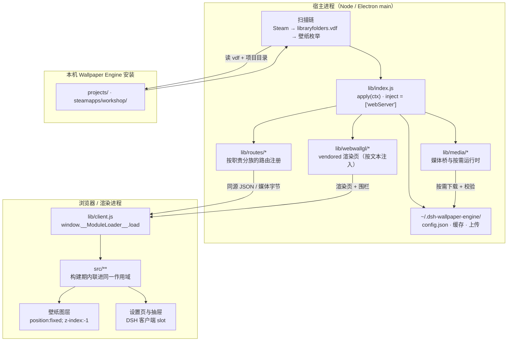
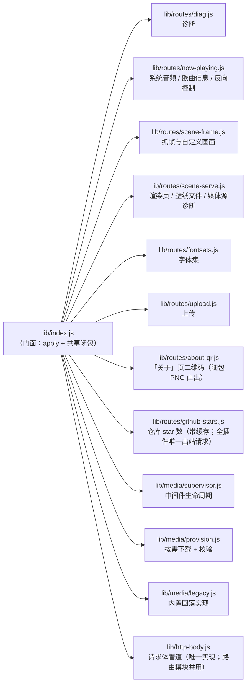
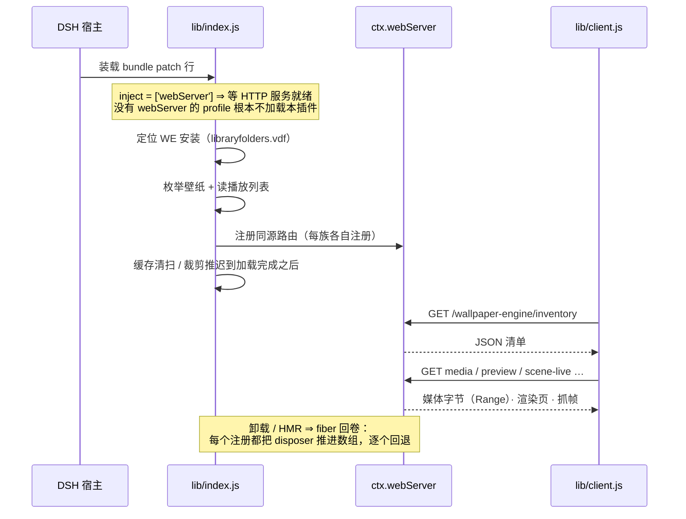
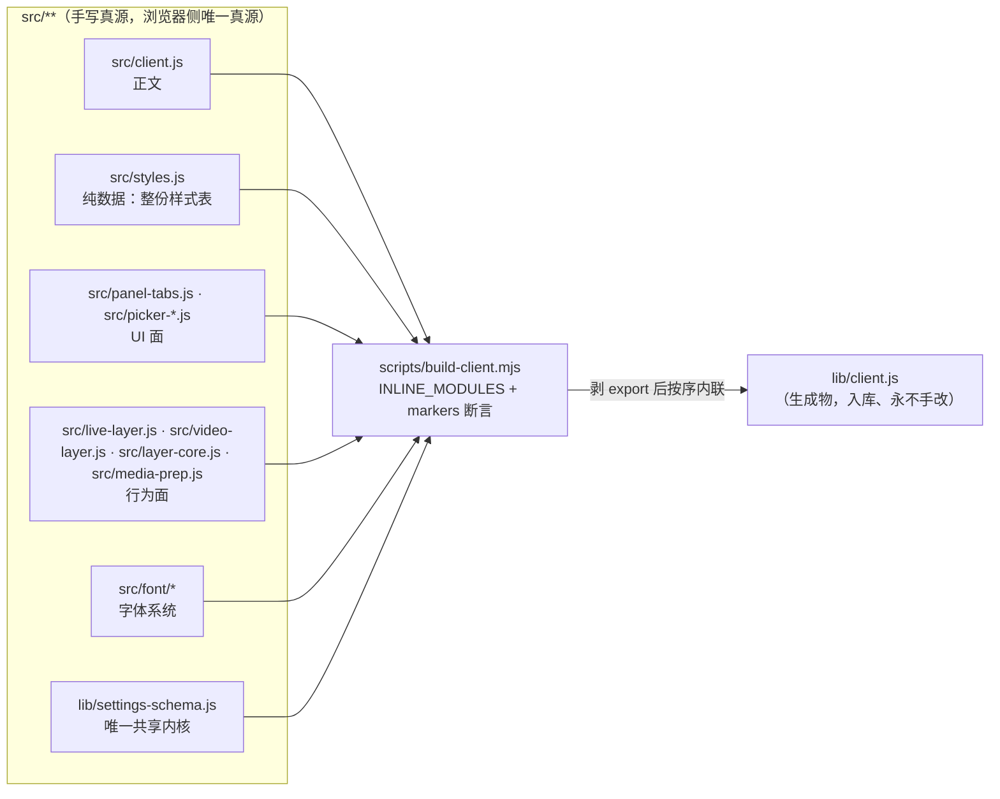
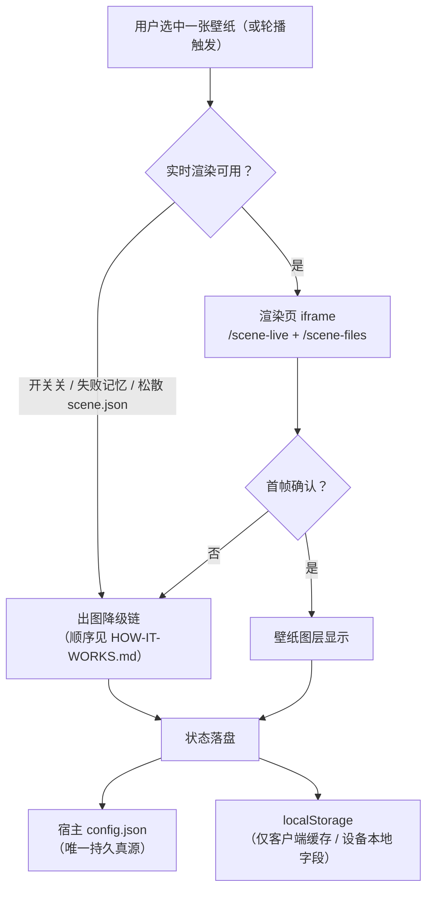

# 代码结构与边界（Code structure）

> **English**: `en/CODE-STRUCTURE.md`（**已随 2026-10 文档瘦身撤除**：维护者向文档只留中文，见 [`README.md`](./README.md) §语言结构）
>
> **本文回答三件事**：**代码放哪**（新文件落点）、**结构长什么样**（谁调用谁、数据往哪流）、**边界在哪**（什么算越界）。
> **为什么这么选**写在 [`adr/`](./adr/)；**机制与不变量**写在对应文件的头注释里（本仓纪律：能写在代码旁的规则不单写文档）；**怎么加一个东西**见 [`DEV-GUIDE.md`](./DEV-GUIDE.md)。
>
> 本文由两份文档合并而成（原 `MODULE-LAYOUT.md` ⊕ `ARCHITECTURE.md`）：它们本就是同一条轴上的内容 ——
> 前者是**规范**（判据、准入门槛），后者是**总览**（结构、生命周期、真源）。合并它们是为了让"代码结构"
> 只有一处可读，代价是本文比单看任一份长。
>
> **改动纪律**：改本文的**规则**时，若该规则在 §6 有配套守卫，必须**同一次提交**里一并改掉（反之亦然）；
> **没有配套守卫的规则靠约定成立**，不许为了凑"有守卫"而新加一条读散文的判据
> （[`adr/0006`](./adr/0006-comment-discipline-as-written-convention.md)）。
> **不写会漂的数值**（条数 / 行数 / 门槛 / 体积）：一律指向真源或给复算命令。

## 读者路径

| 你想知道 | 读哪里 |
|---|---|
| 用户可见行为、出图降级链、路由表 | [`HOW-IT-WORKS.md`](./HOW-IT-WORKS.md) |
| **代码放哪 / 结构 / 边界** | **本文** |
| 某个设计为什么是这样 | [`adr/`](./adr/) |
| 怎么加一个路由 / 设置项 / 浏览器端模块 / 守卫 | [`DEV-GUIDE.md`](./DEV-GUIDE.md) |
| 跑测试、写测试、两档判据 | [`DEV-GUIDE.md`](./DEV-GUIDE.md) §4 |
| 权限与升级 | [`UPGRADING.md`](./UPGRADING.md) · [`TROUBLESHOOTING.md`](./TROUBLESHOOTING.md) |

---

## 1. 一条轴，不是两条

分工不是"`lib` = 服务端 / `src` = 客户端"，而是两个**正交**属性：

| 属性 | 判据 | 它决定什么 |
|---|---|---|
| **跑在哪个进程** | 要在浏览器里跑吗？ | 放 `src/` 还是 `lib/` |
| **是否随包发布** | 在 `package.json` 的 `files` 里吗？ | 能不能留死码 / 能不能放只给开发用的东西 |

组合出的四格，就是本仓的全部落点：

| | **随包发布** | **不发布（开发面）** |
|---|---|---|
| **浏览器进程** | `lib/client.js` —— **生成物，全仓唯一一个** | `src/**` —— 浏览器侧的**唯一真源** |
| **宿主进程**（Node / Electron main） | `lib/index.js` ＋ 它 import 的 `lib/**` 模块 ＋ `lib/webwallgl/`（第三方副本；`lib/vendor/` 是**约定**允许的另一个落点，当前为空——最后一份自带副本已随其唯一消费者退役） ＋ `lib/types/` | **`test/`（守门：`verify-*` + `*-smoke` + `e2e-*`）· `test/tools/`（诊断/分析/生成工具）** · `scripts/`（只有 `build-client` / `prepare`，构建与发布期用）· `docs/` ＋ 本机未跟踪的研究 / 取证目录（由忽略规则覆盖，**不入库、也不被入库文档引用**） |

### 1.1 一份代码，两个半边（两种运行形态）

本插件是**一个 npm 包**，但同时是两种东西 —— 两条加载路径**互不知道对方存在**：

| 身份 | 入口 | 谁加载它 | 跑在哪 |
|---|---|---|---|
| **Cordis 宿主插件** | `lib/index.js` 的 `inject` / `apply(ctx)` | DSH 宿主按 bundle patch 行装载 | Node（Electron 主进程侧） |
| **DSH 客户端插件** | `lib/client.js`（`exports["./client"]` + `package.json` 的 `dsh.client` 清单） | DSH **客户端加载器**按包元数据取（宿主不提供任何路由发它） | 浏览器 / 渲染进程 |

各自能写什么、改完怎么生效：

| | **宿主半** | **浏览器半** |
|---|---|---|
| 入口 | `lib/index.js`（`package.json` 的 `main`；`apply(ctx)`） | `lib/client.js`（由客户端加载器 `window.__ModuleLoader__.load({ id, factory })` 消费） |
| 源码在哪 | **就是 `lib/*.js` 本身**（手写、直接发布） | **`src/**`**：`src/client.js` 是正文，其余是构建期内联的模块 |
| 可用什么 | `node:*`、`worker_threads`、`child_process`、`fs` | `document`、`fetch`、DSH 客户端 ctx 服务；**无 `node:`、无 `import`** |
| 改完怎么生效 | **必须重启 DSH**（`lib/*.js` 启动时加载，不热更） | `npm run build` 重新生成 `lib/client.js` |

> 两条路径的**唯一接口**是 HTTP 路由表。因此路由表是**生成物**
> （`docs/ROUTE-INDEX.md`，由 `test/tools/host-route-index.mjs` 重算并逐字节核对）—— 手写必烂，本仓有过教训。

---

## 2. 宿主半边：门面 + 路由族

`lib/index.js` 是**门面**：它做注册与协议聚合，**不装新逻辑**。随着功能增长，成族的职责被抽成模块：

**族的形态有明文规定**（§4 第 1 条）：路由模块从 `apply(ctx)` 拿一个**显式 context 对象**
（字段就是它用到但不属于它的东西），而不是继承 `lib/index.js` 的 import。这条边界由守卫
`verify-module-layout` 的『路由模块不得"继承" lib/index.js 的 import』一节钉住。

**为什么门面不拆干净**：一部分共享可变状态（媒体源地址、载荷账本、缓存索引）必须与 `/inventory`
同作用域。因此门面仍持有一组闭包状态，跨模块只能以**访问器**形式出去 —— 传值就是陈旧快照。

### 2.1 启动与生命周期

- **`webServer` 是硬依赖**：声明在 `inject` 上，由 Loader 等待 —— 无 HTTP 服务的 profile
  **不加载**本插件，而不是加载后崩溃。
- **一切注册都经 fiber**：路由、媒体源、定时器、子进程都在卸载时回退。这条不是可选的 ——
  否则卸载 / HMR 后会留下挂着的处理器。
- **`ctx.webServer` 仍防御性读取**：路由表建不起来时要有明确失败，而不是 undefined 崩。

---

## 3. 浏览器半边：构建期内联，不是模块系统

浏览器半边的真源是 `src/**`，但**运行时没有本地模块解析器**（加载器的 `require` 只服务外部包）。
因此拆出去的模块由 `scripts/build-client.mjs` 在**构建期**按 `INLINE_MODULES` 清单
剥掉 `export` 后注入 `lib/client.js` 的**同一个工厂作用域**。

详细取舍见 [`adr/0003`](./adr/0003-build-time-module-inlining.md)。

**"同一作用域"最容易被低估的后果是名字**：模块被剥掉 `export` 后**平铺进一个作用域**，于是

| 名字这件事 | 由什么兜住 |
|---|---|
| 模块名 ∩ `client.js` 正文 | 构建期**机器提取**（每个模块的顶层声明名 + `export {…}` 列表名）后比对，冲突即 `exit 1` |
| **模块之间**重名 | 构建期的**产物语法检查**（`vm.Script`）—— 平铺后就是 `Identifier '…' has already been declared`，构建失败并点名 |
| `markers` 锚点缺失 | 逐条断言，缺任一即硬失败（所以"这段还在"不是靠人看） |
| 每个 `src/` 模块都被内联 | `verify-module-layout` ①（除 `client.js` 外零孤儿） |
| 搬动后相对说明符仍可解析 | 同守卫 ④（Node 式解析 —— 动态 `import()` 的失败是运行期，必须静态判定） |
| 浏览器安全（无 `import` / `require` / Node API） | 构建期逐条断言，且**先剥注释再判** |

> ⚠️ 唯独**漏登记 `INLINE_MODULES` 不报错** —— 那个文件永远不进产物，调用点一到运行期就是
> `ReferenceError`（本仓踩过一次）。这是本路线最危险的失效模式。

### 3.1 "同一作用域"到底意味着什么（模块分工与依赖方向）

**这是浏览器半边最容易误判的一层**：模块之间**不 import**，却共享**一个扁平符号命名空间**
⇒ "这个模块从哪拿外界"不是靠 import 表达的，而是靠**谁在文件头声明了它**。
（逐模块的契约与依赖清单住在**各文件头**，本文不复制。）

| 角色 | 模块 | 谁给它外界 |
|---|---|---|
| **状态真源 + 装配（门面）** | `src/client.js`（正文） | 自己持有：设置 store（`selection`）、持久化、`apiFetch`、`weT` 接线、React 根、`ctx` 的组装点 |
| **接收 `ctx` 的渲染 / 行为层** | `live-layer` · `panel-tabs` · `sidebar-right` · `picker-modal` · `picker-props-panel` · `theme-follow` · `fontset-editor` · `font/apply` · `font/color-roles` | **门面在调用点组装 `ctx` 传进来** —— 这一层里**不**直接读 `selection` |
| **基座（无 `ctx`，读扁平符号）** | `media-prep` · `picker-model` · `video-layer` · `effects` · `quick-panel` · `i18n` · `api-client` · `adapter` · `we-cond` · `persistence` · `fontset-store` | 直接读**同作用域**的符号；自己的符号反过来被正文读 |
| **纯数据 / 常量表** | `styles.js`（整份样式表）· `i18n-copy.js`（词表）· `about-assets.js` · `font/typography.js` · `font/components.js` | 无外界 |
| **通道 / 工具** | `layer-core`（两条通道共用的切换核心） · `nav-icon` · `persistence` · `fontset-store` | 见各自文件头 |

**依赖方向单向，但两侧含义不同**：

- 正文 → 模块（给 `ctx`，或读模块的顶层声明）＝ **常规**；
- 模块 → 正文的**顶层读**是**禁止**的：注入点在 bundle **顶部**、早于正文 ⇒ 撞 TDZ（§5 第 2 条）；
- 反过来"模块把符号导出给正文读"是**允许**的（`live-layer` 的 `LIVE_FIRST_FRAME_MS` 就因此导出）。

⇒ **改一个常量前必须先确认它住哪个文件**：改错了地方会"看起来改了却没生效"。

> 为什么这条值得单独写：§1.1 的两半图只画到"`src/**` 内联进同一作用域"，
> 而"同一作用域"**到底意味着什么**（谁能读谁、改哪里才算改对）此前没有任何一处写下来 ——
> 每个模块头只讲**自己**的契约，跨模块的这张分工表**只能靠读遍 20+ 个文件头重建**。

**函数族（"这几块是一伙的"）—— 登记在这里，不靠目录表达。** `src/` 的目录不承载机器含义
（§4 第 1 条），所以"谁和谁一伙"这件事只在本文登记；**只有 `src/font/` 走目录**（门槛见 §4 第 1 条）。
判据是**家族内部**互相读取，不是文件名前缀，也不是被多少模块读（fan-in 高多半只是**门面装配耦合**）：

| 族 | 成员 | 家族内耦合（实测） | 目录 |
|---|---|---|---|
| **字体子系统** | `font/apply` · `font/components` · `font/color-roles` · `font/typography` | `components → apply` ×13 · `→ color-roles` ×10 | ✅ `src/font/`（门槛① 4 个成员 + 门槛② [`FONT-SYSTEM.md`](./FONT-SYSTEM.md)） |
| **picker** | `picker-model`（纯函数、零外界） · `picker-modal` · `picker-props-panel` · `quick-panel` | `modal → model` ×30 | 平铺（见下） |
| **渲染器层** | `panel-tabs` · `picker-modal` · `picker-props-panel` · `fontset-editor` | **互相零读取**（只读门面与纯函数工具） | 平铺 |
| **媒体管线** | `live-layer` · `video-layer` · `media-prep` · `layer-core` · `effects` | `live-layer` → 家族内 | 平铺 |
| **设置与宿主通道** | `persistence` · `fontset-store` · `adapter` · `api-client` · `i18n` | 互读少 | 平铺 |

**为什么不给上表除 `src/font/` 之外任何一族建目录**（一次性裁决，别再重新讨论）：

| 族 | 不建的理由 |
|---|---|
| **picker** | 门槛②需要**新建一份权威文档**（`FONT-SYSTEM.md` 的对应物）；四个成员里 `picker-model` 是纯数据层、`quick-panel` 是组件，**形态不同**，是否同收取决于"选择器"被定义为数据 + 视图还是再加一层外壳。收益上限只是"一眼看出是一伙的"，而成本见 §4 第 1 条的"搬动的成本" |
| **渲染器层** | 它是同一**架构层**，不是一伙人（成员**互相零读取**）。且与 picker **归属冲突**（`picker-modal` / `picker-props-panel` 同属两族），而规则没写优先级 ⇒ **同一优先级只开一个** |
| **媒体管线** | `src/video-layer.js` 头注释写明它独立的**全部理由**就是"**不**在实时那条路里"（真机踩过十几秒纯色帧）；`src/layer-core.js` 的围栏专门钉"与壁纸类型无关"。收进同一目录**正好从目录上抹掉这条边界** |
| **设置与宿主通道** | `src/fontset-store.js` 头注释写明"**另立一条**而不是并进 `persistence.js`"（真源/键集/失败语义都不同）；目录名会传递"这些是一回事"的**误读** |

**四条通用反例**（同样适用于今后新增的族）：按**文件名前缀**机械分组（`video-layer` 与 `live-layer`
前缀相同却是两条**刻意分开**的通道）· 按 **fan-in/cluster** 聚类 · 把"**不读 `selection`**"当分组依据
（那是一张**角色清单**，成员之间零耦合）· **同时开两个新目录**（归属冲突，见上）。

### 3.2 样式与令牌：三层入口，各改一处

界面样式**不在任何 `.css` 文件里**（除了 `lib/webwallgl/` 那套 vendored 渲染页，与插件 UI 无关）。
它分三层，**每一层只有一个入口**：

| 层 | 真源 / 入口 | 怎么生效 | 改哪里 |
|---|---|---|---|
| **整份样式表** | `src/styles.js` 的单个模板常量（纯数据） | 构建期内联进 bundle；运行时 `ensurePluginCss()` 把同一个 `<style>` 挂进 `document.head`，带 `data-plugin-css` 标记与**代际**标记，重挂载时按当前 bundle 内容刷新 | 改 `src/styles.js` → `npm run build` |
| **运行时令牌**（`--we-*`） | `src/effects.js`：`applyEffects()` 往 **`document.body.style`** 写整族 CSS 变量（**玻璃那一族自 `src/glass.js` 抽出**：`applyGlass()` 写各面釉层变量与门控属性；其余写点分散在 `src/live-layer.js` 与 `src/font/apply.js`，各管自己那几项——**要数当前有几处就复算**：`git grep -c 'setProperty(' -- src`） | 样式表里的规则读 `var(--we-*)`；设置一变就重写那几个属性 | 改 `src/effects.js` / `src/glass.js`（**不是** `styles.js`） |
| **字体自定义** | `src/font/apply.js`（宿主默认值快照 + 组件作用域样式表） | 单独一条通道，见 [`FONT-SYSTEM.md`](./FONT-SYSTEM.md) | 改 `src/font/` |

> **判据落在哪也照这个分**：`verify-readability` 会**从产物里抽出** `src/effects.js` 的钳制函数
> 复算对比度网格（所以"改样式表就能过判据"不成立）；`verify-host-paint-scope` 从产物里取样式表
> 判"满屏浮层放行拖拽"。⇒ **改哪一层，就去哪一层对应的真源改** —— 这是本仓"一处定义"在样式上的形态。

---

## 4. 新文件放哪（决策程序）

按顺序问六句，第一句命中就停：

1. **要在浏览器里跑吗？**
   → `src/**`，**并且必须登记进 `scripts/build-client.mjs` 的 `INLINE_MODULES`**（含 `markers` 锚点）。
   ⚠️ 忘了登记**不会报错**，只是这个文件永远不进产物（本仓踩过一次）。
   **`src/` 默认平铺**：根目录就是默认落点。只有当一个子系统**同时**满足两条时，才为它建子目录：
   - ① **成员数达到准入门槛**（`.js` 计数，含嵌套）—— 门槛的**唯一真源**是守卫里的
     `SRC_DIR_MIN_MEMBERS`（`test/verify-module-layout.mjs`），本文不抄那个数字；
   - ② **有自己的一份权威文档**，且那份文档的**一级标题**点名这个目录 —— 唯一样本是
     `src/font/`（[`FONT-SYSTEM.md`](./FONT-SYSTEM.md) 的一级标题即 `# src/font/ —— 字体系统`）。
     ⚠️ **这一条是纯约定，无守卫**：原先 `verify-module-layout` ⑥ 有一条"H1 点名"判据，
     已按 [`adr/0007`](./adr/0007-machine-checks-target-code-not-prose.md) 撤除 ——
     它守的是标题措辞，而且**空壳文档（标题对、正文空）照样通过**，守的是形式不是实质。
   **为什么门槛这么高**：`src/` 模块之间**没有 `import`**（§5 第 4 条），构建期被拍平进同一个工厂作用域
   ⇒ 目录在这一侧**不承载任何机器含义**：没有解析器、也没有守卫能验证"层次"。它唯一的作用是
   "让人一眼看出这几块是一伙的"，而只有一两个文件的目录做不到这件事，只多一层路径与一次搬动。
   反过来 `lib/` 的目录是**承重**的（Node 真解析相对说明符、`files` 逐文件登记）⇒ 两侧准入条件
   不同，别互抄。**① 由 `verify-module-layout` ⑥ 判（带负对照），② 靠约定。**
   **搬动的成本（实测，用来判断"值不值得"）**：搬一个模块要同步改 —— `INLINE_MODULES` 条目
   （含它的 `markers`）· **`test/` 里对 `src/*.js` 的路径引用**（约 241 处，其中**真读磁盘**的仅
   约 25 处会当场红，其余是注释与字符串 —— **不报错，只会悄悄变成错的话**）· `src/` 注释里的
   互引（约 148 处）· `docs/` 与三份 README 里的路径（约 122 处）· `scripts/`（约 34 处）·
   重建 `lib/client.js` · 若动了路由则重算 `ROUTE-INDEX.md`。
   ⇒ **搬 4 个文件的成本约 1–2 人日**；收益上限是"一眼看出是一伙的"。逐族的裁决与"为什么不建"
   见 §3.1 末尾那张表（**别在那里重新讨论**）。
2. **两侧都要用吗？**（同一份数据/规则同时被宿主与客户端消费）
   → 放 `lib/`（宿主 ES `import`）**并**登记进 `INLINE_MODULES`（客户端构建期内联）。
   这就是 `lib/settings-schema.js` 的形态（设置键单一真源），因此它同时受 §5 全部约束（浏览器安全）。
   **这是唯一被允许的共享形态**，第二个共享内核要显式登记（§6 的共享内核白名单）。
3. **是宿主自己的实现吗？**
   → `lib/<语义名>.js` **并加进 `files`**。按职责分子目录（现状：`lib/media/`、`lib/routes/`）。
   门面 `lib/index.js` 只做注册与协议聚合，**不装新逻辑**。
   → **随包的数据文件**（不是代码，但要跟包走）也放 `lib/<语义名>/`，**同样加进 `files`**：
   现状 `lib/fontsets/`（随包预设，只读；用户的编辑按写时复制落 `pluginDataDir()`）。
   `verify-package-files` P1 要求 `files` 覆盖 `lib/` 下**每一个**文件 —— 漏一条这里就红。
4. **是第三方副本 / 类型声明吗？**
   → vendored 放 `lib/vendor/`（内联副本）或 `lib/webwallgl/`（按文本注入的 shim），**不许改**，
   同步走 `test/tools/sync-webwallgl.mjs`；
   → 类型放 `lib/types/*.d.ts`，**必须与代码一致**。
5. **是开发面的东西吗？**（不进发布包）
   → **守门与冒烟 → `test/`**（`verify-*.mjs` 结构守卫、`*-smoke.mjs` 节点级冒烟、`e2e-*.mjs` 真浏览器端到端）；
   → **诊断 / 分析 / 生成工具 → `test/tools/`**（无 CI 消费者的手动工具）；
   → **构建与发布期脚本 → `scripts/`**（只放 `build-client.mjs` / `prepare.mjs` 这类用户与发布流程真的会跑的）。
   ⚠️ `test/tools/` 比 `test/` **深一层** ⇒ 用 `import.meta.url` 推仓库根时要退**两层**
   （`verify-module-layout` 的『相对说明符必须解析到真实文件』有断言钉住）。
6. **是设计源资产吗？**（原始素材，不进发布包）
   → `assets/<用途>/`，与代码同仓、**不进 `files`**；运行时要用的那版是**派生物**，放
   `lib/<用途>/` **并进 `files`**（`verify-package-files` P1 盯着）。
   现状两处：`assets/mascot/` 与 `assets/about/`（二维码源图 → 裁码后的 `lib/about/*.png`，
   由 `lib/routes/about-qr.js` 直出）。
   ⚠️ 这类目录里的 `README.md` 是**该目录的自述**（替代不了文件头注释时就写在那里：派生口径、
   替换素材的步骤、"源资产不进包"这条不变量），**与 `lib/**` 的 `README.md` 同类**；
   它们**有意不进 `docs/` 的生命周期规则**（不是常青文档，也不随版本演进），
   但**必须能从别处走到** —— 例如 `assets/about/README.md` 由根 `README.md` 的「联系方式」段引用。

**一句话版**：*浏览器手写 → `src/` 且登记内联；两侧共用 → `lib/` 且登记内联；只有宿主 → `lib/` 且登记 `files`；第三方 → vendored 子目录；守门 → `test/`；工具 → `test/tools/`；用户脚本 → `scripts/`；设计源资产 → `assets/`（派生物进 `lib/`）。*

**反例（不要这么做）**
- 把"顺手拆出来的工具函数"放 `lib/`，然后又内联进浏览器 —— 边界就从这里开始烂。
- 在 `src/` 建一个文件却不登记 —— 它静默不生效（本仓有过一例）。
- 为了少改一个 import，把宿主模块搬进 `src/` 或反向搬 —— 两侧的**依赖方向是单向**的（§6）。
- 手改 `lib/client.js` 让产物"看起来对"。
- 把一次性诊断脚本丢回 `scripts/` —— 那里只放用户与发布流程真的会跑的脚本（`test/tools/` 才是手动工具的家）。

### 4.1 扩展点速查（加东西时落在哪）

| 要加什么 | 落在哪 | 还必须在哪登记 |
|---|---|---|
| 一条宿主路由 | `lib/routes/<族>.js`（成族才单独成文件，否则就近） | 路由索引由生成器自动重算 |
| 一个设置项 | `lib/settings-schema.js` 的 `DEFAULTS` + `KINDS` | 面板读取即可，**不要另写一张 UI 表**。⚠️ 若涉及**字体角色 / 字号上下限**，浏览器侧那份副本（`src/font/color-roles.js` / `typography.js`）**也要改**（见 §7 第 1 行） |
| 两端都要用的状态 | `lib/<语义名>.js` | `INLINE_MODULES`（构建期内联；这是**唯一**被允许的共享形态） |
| 浏览器端一块 UI / 行为 | `src/<语义名>.js` | `INLINE_MODULES`（**漏登记静默失效**） |
| 字体相关 | `src/font/`（子目录有准入门槛） | 见 [`FONT-SYSTEM.md`](./FONT-SYSTEM.md) |
| 随包的数据文件 | `lib/<语义名>/` | `package.json` 的 `files`（P1 会判） |
| 设计源资产（原始素材，不进包） | `assets/<用途>/` | 运行时要用的那份是**派生物** ⇒ `lib/<用途>/` 并进 `files`；源图口径写在 `assets/<用途>/README.md` |
| 一条守卫 | `test/`（守门）或 `test/tools/`（手动工具） | 视档位挂进 `verify` / `verify:docs` |

逐步配方（含"改错了会怎样"）见 [`DEV-GUIDE.md`](./DEV-GUIDE.md)。

---

## 5. 硬约束（都由构建期/打包期断言兜住，不是建议）

1. **内联模块必须浏览器安全**：不得出现 `import` / `require(` / `export default` / `process.*` / `__dirname` / `__filename`（`build-client.mjs` 逐条断言，且**先剥注释再判**）。
2. **内联模块不得有顶层可执行语句去读宿主状态**：它们被注入在 bundle 顶部（早于 `src/client.js` 正文），顶层读正文里的 `const` 会撞 TDZ。
3. **名字必须唯一**：内联后与 `src/client.js` 同作用域 ⇒ 重复声明的名字会被构建**机器提取**后断言，冲突即构建失败。
4. **`src/` 模块之间不得 `import`**：它们靠"同一作用域"协作，靠模块头写下的**契约**（需要的外界、对外提供什么）而不是显式依赖。
5. **导出形态**：`src/` 模块用 `export { … }` 列出对外名字；构建剥掉 `export` 关键字与 `export {}` 块。**导出清单同时是守卫的接口**（守卫直接 `import` 模块做行为断言）。
6. **产物入库**：`lib/client.js` 是生成物但**提交**；CI 断言「重建后 `git diff --exit-code -- lib/client.js` 干净」。**永不手改 `lib/client.js`。**
7. **打包面**：`files` 覆盖 `lib/` 全部运行期文件（P1）；具名入口既存在又被发布（P3）；每个运行时模块的**相对导入目标都在磁盘上**（P7）；`dependencies` 每条都真的被 `lib/` import（P4）；build/verify/smoke 链**零裸依赖**（P5）；发布面文件**不得带 UTF-8 BOM**（P8）。
8. **发布面必须"装上就能跑、且不多带东西"**（npm 方向的四条，见 `verify-package-publish`）：
   ① 活的代码所需文件（从 `lib/index.js` 出发的**可达闭包**）必须全在 `files` 里，且闭包里的每个相对
      导入目标都**真实存在于磁盘** —— 指向不存在文件的 import 在仓库里是死路径，装到用户机器上才炸成
      `ERR_MODULE_NOT_FOUND`；
   ② 发布集里不得出现 `src/` `scripts/` `test/` `docs/` 等开发目录；恰有一条白名单 `scripts/prepare.mjs`
      —— `prepare` 在 git 直装、或把包装成根项目执行时真的会跑，它不随包 = 一跑就 `MODULE_NOT_FOUND`；
   ③ 发布文本里不得带**同步机器**的用户目录路径（占位符不算）—— 那是不可复现的元数据；
   ④ `dependencies` 每一条都必须被**可达闭包**加载（死码 import 不算 ⇒ 否则是白下载）。

### 5.1 层间边界（什么算越界）

| 边界 | 规则 | 由什么兜住 |
|---|---|---|
| 宿主 ↔ 浏览器 | 只经**同源 HTTP 路由**；浏览器半边不得 `import` 宿主代码 | 无本地模块解析器（结构上不可能） |
| `lib/` → `src/` | **禁止**：`lib/**` 不得 import `src/**`（依赖方向单向） | `verify-module-layout` ②（零容忍） |
| 发布面 | 留在 `lib/` 的一切都会被发布 ⇒ 死码不许留 | `verify-package-files` · `verify-reachability` |
| 门面 | `lib/index.js` 只做注册与协议聚合，不装新逻辑 | `verify-module-layout`『路由模块不得继承门面 import』 |
| 注释与文档 | 机制写文件头、决策写 ADR、数值指向真源 | **约定**（无守卫，见 [`adr/0006`](./adr/0006-comment-discipline-as-written-convention.md)） |

---

## 6. 守卫（与本文结构规则同名的那批；全量清单的真源是 `package.json`）

> **本表只登记"与本文结构规则直接相关"的机器判定**，不是全量名册。**全量清单的真源是
> `package.json` 的 `verify` / `verify:docs` / `smoke` 三个脚本**（读它们即得；抄一份进本文
> 就是多一个无人复算的副本）—— 两档判据、逐条约定与运行矩阵见
> [`DEV-GUIDE.md`](./DEV-GUIDE.md) §4。
>
> 因此**不在表里 ≠ 没有机器判定**。链上还有一批同属"读**代码**"的结构性判据（路由索引生成物
> 对照、i18n 双向对账、跨半边契约、`/about-qr` 资源在包内、死声明、可达性棘轮、退役线、
> 模块布局的 ⑤/⑦/⑧、产物同步）—— 它们与本文 §1–§5 的边界**不重叠**，故不逐条搬进来。
> 边界纪律本身见 [`adr/0006`](./adr/0006-comment-discipline-as-written-convention.md) /
> [`adr/0007`](./adr/0007-machine-checks-target-code-not-prose.md)：
> **读代码的守卫照留，读文档散文的守卫不加**。

| 规则 | 现状（含档位：硬档挡 PR / **软档只出声**） | 缺口 |
|---|---|---|
| 内联模块浏览器安全 / `markers` 在位 / 名字不与正文冲突 | ✅ `scripts/build-client.mjs`（构建期硬失败） | — |
| `files` 覆盖 `lib/`；具名入口在位；相对导入目标都在磁盘上；依赖无死声明；工具链零裸依赖；**发布面无 BOM**；内联产物可被 `node --check` 解析 | ✅ `test/verify-package-files.mjs` P1–P8（**其中六条各带负对照**；P1/P3 复用 P2 的判据，不另设对照） | — |
| **发布面自洽（npm 方向）**：可达闭包 ⊆ `files` 且闭包目标在磁盘上在位；发布集无开发目录（白名单只放行 `scripts/prepare.mjs`）；发布文本无**同步机器**的用户目录路径；`dependencies` 每条都被**活的代码**加载；入口/导出目标都在包里；发布出去的 `lib/client.js` 是加载器形态且可解析；安装期脚本不得引用未随包发布的文件 | ✅ `test/verify-package-publish.mjs`（**七组，六组带负对照**；"入口与导出目标"那组是正断言） | — |
| `lib/client.js` 与 `src/` 同步 | ✅ `test/verify-client-sync.mjs` —— **`verify` 链首条**：真跑构建、折行尾后逐字节比对（不用 git）；CI 另有 `git diff --exit-code` 作第二条腿 | — |
| **`src/` 无孤儿**：除 `src/client.js` 外每个文件都必须在 `INLINE_MODULES` 里 | ✅ `test/verify-module-layout.mjs` ①（全量扫描 + 负对照）・**软档** | — |
| **依赖方向单向**：`lib/**` 不得 import `src/**` | ✅ 同守卫 ②（零容忍，不需要棘轮）・**软档** | — |
| **共享内核白名单**：允许被内联进浏览器的 `lib/**` 文件只许来自一张显式清单（现状见守卫里的 `SHARED_KERNEL_WHITELIST`） | ✅ 同守卫 ③（再加一条必须改清单 ⇒ 共享是**决策**而不是顺手）・**软档** | — |
| **`src/` 子目录准入（① 成员数）**：`.js` 计数达 `SRC_DIR_MIN_MEMBERS`（§4 第 1 条门槛之一；② "有自己的一份权威文档"是**约定，无守卫**） | ✅ 同守卫 ⑥（带负对照）・**软档** | — |
| **相对说明符必须解析到真实文件**：搬动代码后相对路径按新位置重解析（动态 `import()` 的失败是运行期、且常被吞成业务错误 ⇒ 必须静态判定） | ✅ 同守卫 ④『相对说明符必须解析到真实文件』（Node 式解析 + 负对照）・**软档** | — |
| **类型面与代码同源**：`lib/types/*.d.ts` 必须与实现一致 | ✅ `test/verify-types.mjs`：`.d.ts` 的**声明集 == 手工钉住的必需字段集**，且每个字段在实现里确有生产者 | — |
| **收 body 的路由必须有上限，且收完只解码一次**：逐块累加而不比较长度 ⇒ 宿主堆无界增长；逐块 `toString()` ⇒ 跨 TCP 分片的多字节码点被切成 U+FFFD（用户可见字符串被静默写坏） | ✅ `test/verify-body-caps.mjs`（**从磁盘枚举**每个 `req.on('data')` 站点，8 条正/负对照 + 覆盖面地板；"裸标识符回调"是**结构性**豁免，不是名单）・**硬档** | 八条路由仍各写一份收 body 管道 ⇒ 尚未收敛成一个 `readBody()`（本行只保证"有上限"，不保证"只有一份实现"） |
| **路由族触发线**：某个路径首段族达到 ≥3 条路由 ⇒ 回来裁决（按族拆出 `lib/routes/<族>.js`，或改账本 §7-6 那条线并同改判据） | ✅ `test/verify-route-families.mjs`（枚举口径 = `host-route-index` 的 `buildIndex()`；归族规则与 `analyze-host-apply.mjs` ② 组逐字相同；带正/负对照与覆盖面地板）・**硬档** | — |

**已从本表撤除**（各自的原因写在对应 ADR 里）：

| 曾被守的规则 | 撤除原因 |
|---|---|
| **本文散文里的数字必须现算**（内联模块计数 == 构建清单条数） | 守的是**措辞**：句子一改写，判据就从"复算数字"退化成"守住那两句话"，开始拦编辑而不是拦腐化。数值改由**符号引用**承担。见 [`adr/0006`](./adr/0006-comment-discipline-as-written-convention.md) |
| **`src/` 子目录被某份常青文档的一级标题点名**（§4 第 1 条门槛②） | 守的是**标题措辞**，且**空壳文档照样通过** ⇒ 守形式不守实质。门槛② 改由约定承担。见 [`adr/0007`](./adr/0007-machine-checks-target-code-not-prose.md) |
| **源码里的文案片段**（状态行三分支措辞、提示语、`ESC 返回`、四字状态片段、设置入口的 `/设置\|Settings/i` 锚点） | 第 1/4 问：判定对象是**人的措辞**。其中设置入口那条更糟——它的失败信号要求"保持原样"，而原样正是那个 locale 缺陷 ⇒ 判据站在修复的对立面。改判**机制**：三分支且每支是 `weT(...)`（`test/verify-adapter.mjs`）；锚点候选集存在 + 门控 / 排除自家入口 / 无名字兜底 / 重入锁在位（`test/verify-scene-live.mjs`）。见 [`adr/0007`](./adr/0007-machine-checks-target-code-not-prose.md) |
| **一次性清理的验收判据**（退役线里的"笔误「秡」不再出现"） | 修完即**恒真**；按 §写作纪律 5「删完清空即为零残留」，收口时就该撤。见 [`adr/0007`](./adr/0007-machine-checks-target-code-not-prose.md) |

**本文怎样才算"规范"**：§5 的硬约束与 §6 在册的守卫同时成立即可 —— 两者现在都成立。
升为规范的**过程记录**（当时的四条偏离如何逐条收敛）属于历史，已归档在
[`archive/REFACTOR-ASSESSMENT.md`](./archive/REFACTOR-ASSESSMENT.md) 与
[`archive/wip/OPEN-ITEMS.md`](./archive/wip/OPEN-ITEMS.md)，本文不重复。

---

## 7. 状态住哪（唯一真源清单）

| 状态 | 真源 | 谁读 | 结构 |
|---|---|---|---|
| **设置的全部键**（默认值 / 范围 / 枚举） | `lib/settings-schema.js` | 宿主 **和** 客户端 | 构建期内联给浏览器（唯一共享内核）。⚠️ **但文字颜色角色的 id、排版角色的 id 与字号上下限各有一份逐字副本**在 `src/font/color-roles.js` / `src/font/typography.js` —— 因为宿主也 `import` schema，而 `src/font/**` 只进浏览器包（该文件自己的注释原话："两份必须一致"）⇒ **改角色必须同时改两份**，由 `verify-theme-layer` / `verify-component-fonts` 机械对账。**副本的条数与取值一律看这两处源码**，本文不抄 |
| **持久化的值** | 宿主 `config.json` | 宿主写；客户端读 inventory、写经保存接口 **+ 三个根字段端点**（`/we-assets-dir` · `/upload-dir` · `/fontsets` 的 `activate`） | 客户端 `localStorage` = 设置的**缓存** + **设备本地字段**（`rope-pos` / `picker-tab` / `qp-view` / `weLive*` —— 这些**不落 `config.json`**，也不在 schema 白名单里） |
| **界面语言 + 译词表** | **宿主 locale 服务**的 `getSnapshot().active`（不是插件设置，缺省 `zh`，`?we-lang` 可覆盖） | `src/i18n.js` 订阅广播 ⇒ 客户端 `weT(...)`；非 React 的 DOM 补丁走 `weOnLocaleChange` | 词表住 `src/i18n-copy.js` 两张（客户端 / 宿主）；键集由 `verify-i18n` **双向对账**（漏译、孤儿键、`weT` 未包的中文各一条判据）。**不落 `config.json`** |
| **活动字体集** | `config.json` 的根字段 `fontSetId` ⇒ `lib/fontsets/*.json`（随包只读预设）+ `pluginDataDir()/fontsets`（用户层，写时复制） | 宿主路由 `/fontsets`；客户端 `src/fontset-store.js` | **与设置平行的另一条真源**（`build-client.mjs` 的 `why` 原话）—— 六个字体键**不在** settings 白名单里；`localStorage` 的 `we-fontset-active` 只是缓存 |
| **路由表** | `docs/ROUTE-INDEX.md`（生成物） | 人 + 守卫 | 由 `test/tools/host-route-index.mjs` 复算 |
| **构建期内联清单** | `scripts/build-client.mjs` 的 `INLINE_MODULES` | 构建 + 守卫 | 带 `markers` 锚点 |
| **发布面** | `package.json` 的 `files` | 守卫 P1–P8 | 留在 `lib/` 的一切都会被打进包 |
| **star 数缓存**（全插件唯一出站请求的状态） | `lib/routes/github-stars.js`：进程内 TTL + `pluginDataDir()/star-count.json` | 客户端 `src/client.js` 的 `starCount` 镜像（**自己一份同量级 TTL**） | 仓库地址的真源是 `package.json` 的 `repository`，宿主**现读**（不另抄字面量）；拉到失败**不写**时间戳 |
| **「关于」页静态数据** | `src/about-assets.js`（仓库地址 + 两条路由路径） | 客户端渲染 + `lib/routes/about-qr.js` 直出 PNG | 二维码**源图**在 `assets/about/`（不进包），随包的是裁码后的 `lib/about/*.png`；文件名白名单在服务侧**另有一份逐字副本**（换码只换 PNG，不重建产物） |
| **退役线 / 死码基线** | `test/verify-retired-lines.mjs` · `test/verify-reachability.mjs` | 守卫（**软档**：失败只出声） | 前者 = "退役线里的东西**不许复活**"；后者 = 不可达计数**只许缩小**（棘轮） |
| **对上游的宿主要求** | `package.json` 的 **`engines.dsh`** | **插件市场与 DSH 自己的插件管理 UI** 直接从已发布的 manifest 读它（社区目录不参与），显示在插件卡片上并与运行中的宿主比对；人类读三份 README 与 [`UPGRADING.md`](./UPGRADING.md) 里的同一段散文 | 机读的那份**只有这一处**；散文是它的回声，**改一处就要改全部**。`dsh-better-sidebar` 这类**非** `@deepseek-ai/*` 的依赖**表达不了**，只存在于散文里 |

> **文档一律不抄这些值**。想知道当前值：设置看 `lib/settings-schema.js`，路由看生成物，
> 条数看 `package.json` 的 scripts —— 抄一份就是多一个无人复算的副本。
>
> **本表与 §8 用同一口径**：`localStorage` 里既有"设置的缓存"，也有**只属于这台设备**的字段
> （见上表第 2 行）—— 后者不是任何宿主状态的回声，因此**不能**被"清缓存即可重建"这句话覆盖。
>
> **派生缓存不在此表**：GPU 帧 / 静态帧、转码产物（`tc_*.mp4`，按大小 LRU）、**faststart 变体
> （`fs_*.mp4`，另一条 8GB LRU；成因与口径见 `lib/index.js` 的 `faststartVariant` 注释与
> CHANGELOG 的未发布段）**、视频预览、
> live 帧、诊断目录、inventory（秒级 TTL）、Steam / 内嵌 MP4 探测（后者未命中一律
> **未知 → null，绝不猜**）。它们的真源都是**壁纸源文件本身**，全部可删、可重建。

---

## 8. 一次壁纸的生命周期（数据流）

> **降级链的成员与顺序只在 [`HOW-IT-WORKS.md`](./HOW-IT-WORKS.md) 定义一处** —— 本文只把它当
> 一个结构节点画出来，**不复制它的步骤**（复制一份就会在下一次调整降级顺序时漏改一处）。

**关键结构性质**：

- **降级是链式的，不是二元的**：任何一级失败都有下一级接手，最后一级允许"诚实留空"。
- **失败记忆分两层**：**共享设置**（所有窗口共用，会被落盘）与**会话内软失败**（不落盘）。
  传输类失败只进后者 —— 一次被饿死的传输不该变成每个窗口的永久降级。
- **隐藏 / 未播放的实例根本不拉载荷**：建层时延迟赋 `src`、切后台摘成 `about:blank`，
  否则它会和看得见的那个抢带宽与解码器。
